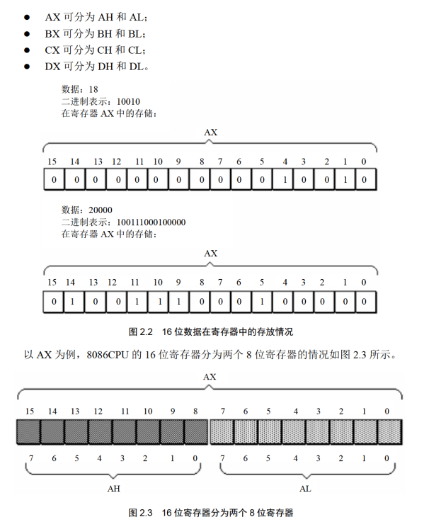
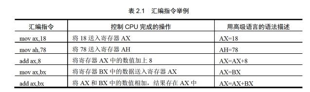
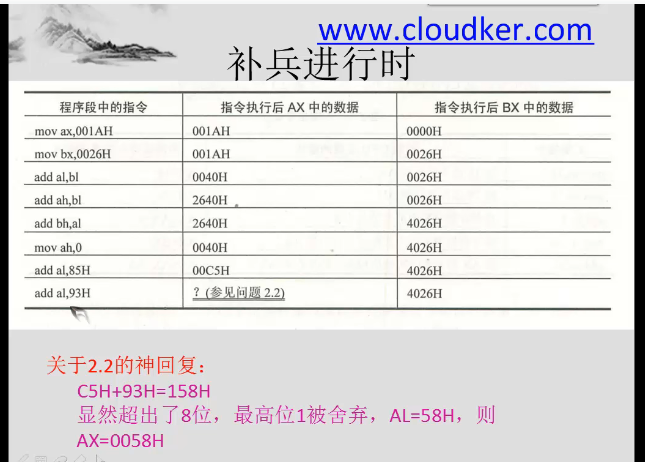
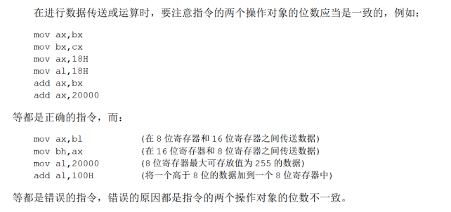
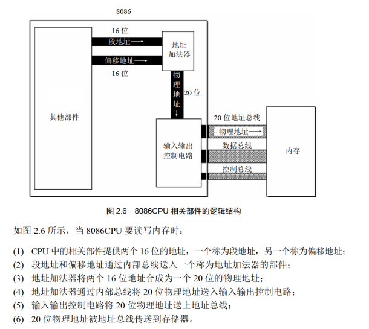

# 内容
## 寄存器
8086由十四个寄存器

## 通用寄存器
AX BX CX DX

用于存放一般性数据

都是16位的，但又分为高八位和第八位

比如AX分为AH和AL

以下的区分只要是为了向下兼容

## 指令

这里需要记住位的概念

比如上面这个例子，是怎么计算的

然后还需要知道，AL和AH之间也不互相影响


## 操作对象一致性

这里对于初学者需要特别注意

## 监测点2.1
1.
|题|答案|
|---|---|
|mov ax,62627	|AX=F4A3H|
|mov ah,31H	|AX=31A3H|
|mov al,23H	|AX=3123H|
|add ax,ax	|AX=6246H|
|mov bx,826CH	|BX=826CH|
|mov cx,ax	|CX=6246H|
|mov ax,bx	|AX=826CH|
|add ax,bx	|AX=04D8H|
|mov al,bh	|AX=0482H|
|mov ah,bl	|AX=6C82H|
|add ah,ah	|AX=D882H|
|add al,6	|AX=D888H|
|add al,al	|AX=D810H|
|mov ax,cx	|AX=6246H|
2.
```8086 assembly
mov ax,2H
add ax,ax
add ax,ax
add ax,ax
```
## 物理地址
唯一的地址是物理地址



## 段地址、偏移地址
都是16位，最后合成20位


段地址*16+偏移地址=物理地址

### 段的理解
并没有真正的段

同时，一个段最大是64KB

## 监测点2.2
1. 10H到1000H
2. 1001H 2000H
3. 小于1001H或者大于2000H即可

## 段寄存器
CS DS SS ES
### CS IP
CS是段寄存器

8086有四个段寄存器：CS DS SS ES

CS是代码段寄存器，IP为指令指针寄存器（偏移地址），组合起来是CPU要执行的指令的地址

CS:IP指向的内容当作当前指令执行
#### 工作流程
1. 从 CS:IP 指向的内存单元读取指令，读取的指令进入指令缓冲器:
2. IP=IP+所读取指令的长度，从而指向下一条指令
3. 执行指令。转到步骤(1)，重复这个过程。

#### 改变值
无法使用MOV直接操作，但是可以使用JMP间接操作

**JMP 段地址：偏移地址**

比如jmp 2AE3:3;CS=2AE3H,IP=0003H

**若想仅修改 P 的内容，可用形如“jmp 某一合法寄存器”的指令完成**

### 监测点2.3
四次，三条指令就三次，JMP一次，四次
IP=0000H

