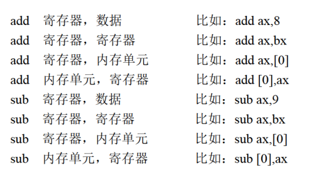
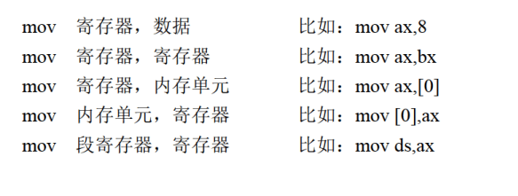

# 字与字节
QWORD DWORD WORD BYTE bit

内存单元，字单元

低地址存低字节，高地址存高字节

这就是小段存储
# DS:[ADDR]
mov al,[0]
其中[0]的意思就是编译地址是0处的内容。

一般形式是：寄存器:[addr]

如果没有寄存器，默认 ds:[addr]

8086CPU一次可以传送16位数据

事实上，只有内存与内存之间不能直接操作。

### 监测点3.1

# 栈
PUSH入栈

POP出栈

都是以字为单位的

比如push ax就是把ax的内容放到栈中

## SS:SP
SS:SP存放了栈顶的地址

push ax
1. sp=sp-2
2. ax中的内容放入栈

## 操作内容
push pop可以操作 寄存器、段寄存器、内存单元

## Stack Overflow
危险的情况，千万小心。

