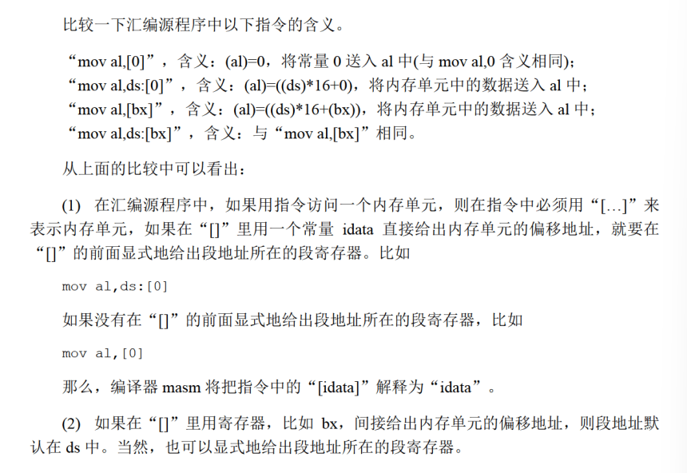

# loop
循环指令，要有标号

`CX`是存放判定条件的

inc、dec：自增、自减

[bx]表示bx之中存储的内容当作偏移地址

DX 累加器

**在汇编源程序之中，数据不能以字母开头。**

Debug的`g`命令,可以直接执行之前的所有汇编命令

`p`命令，可以直接执行完循环
## MASM和Debug的不同

## 回到标题
类型不匹配，怎么解决？

把8位的先赋值到16位寄存器之中，然后再操作

一般我们如果需要向内存写入数据，可以使用0:200~0:2ff的256个字节的空间。