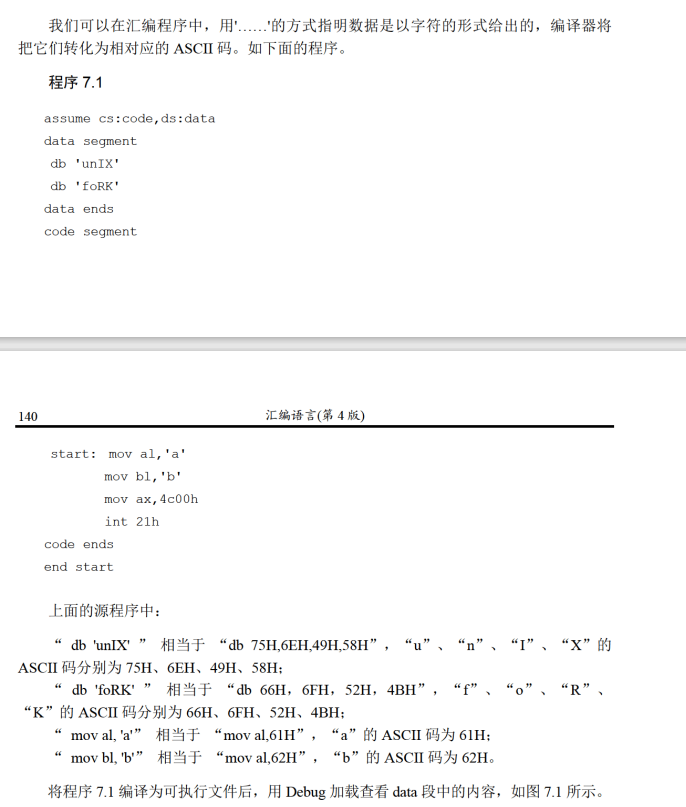
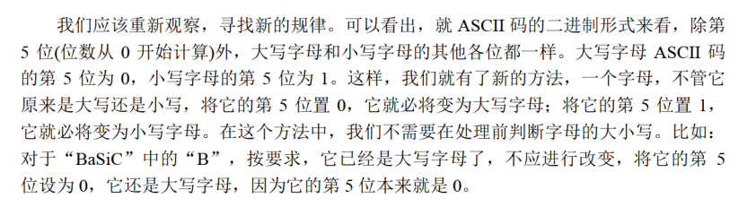
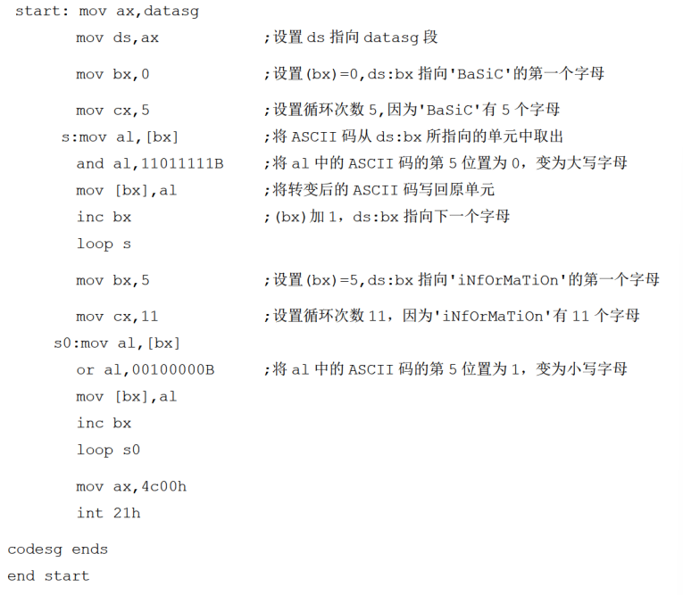
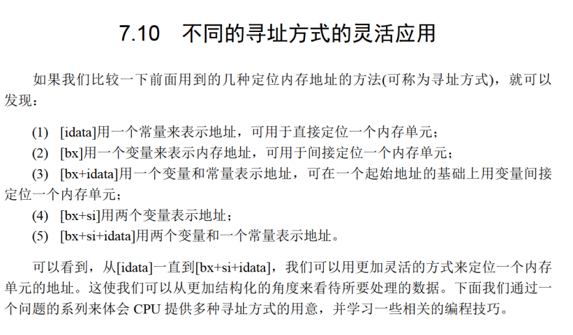

# 与或非
与或非的概念，比较简单
# 字符串

这里的db是指一个字符一个byte

# 大小写转换
ascii码之中，小写=大写+20H

这里主要就是这个第五位(20H的2，即32)


核心就是，转大写：
```
and al,11011111B
```
转小写
```
or al,00100000B
```
# [bx+idata]
[bx+idata]表示一个内存单元，偏移地址为(bx)+idata

有以下几种写法
```
mov ax,[200+bx]
mov ax,[bx+200]
mov ax,200[bx]
mov ax,[bx].200
```

[bx+idata]可以进行类似数组的处理

# SI和DI
和bx功能接近的寄存器，但不能分为两个八位的寄存器使用

分别表示源和目的

[bx+si]

[bx+si+idata]可表示以下形式
```
mov ax,[bx+si+200]
mov ax,[si+bx+200]
mov ax,[200+bx+si]
mov ax,200[bx][si]
mov ax,[bx].200[si]
mov ax,[bx][si].200
```
# 不同寻址方式的灵活应用


# 二重循环
用dx存cx,内层循环结束后，把dx赋值给cx。

如果没有富余的寄存器怎么办？存在内存空间之中即可！

内存需要记忆地址，怎么办？**使用栈！**


