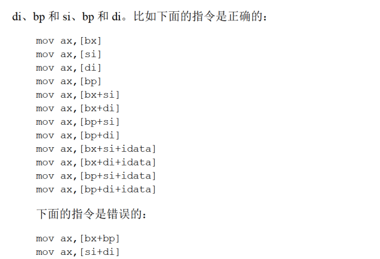
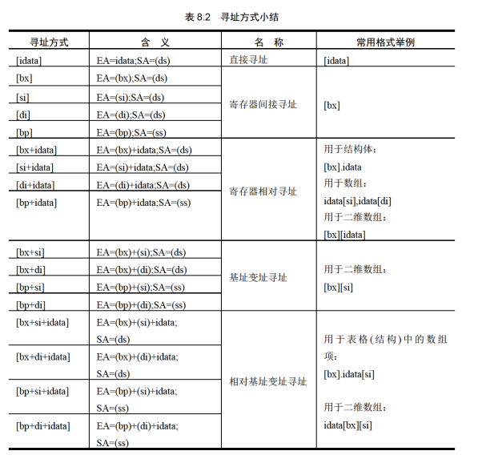
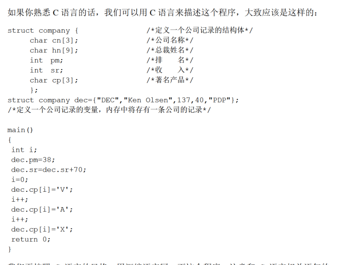
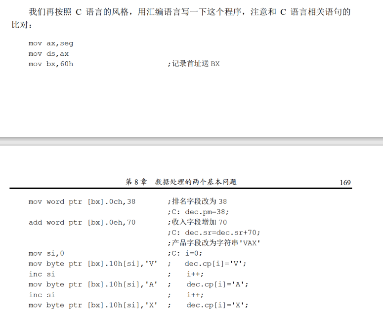

# bx si di bp
只有这四个寄存器用于寻址

同时，bi不能与bp相加，si和di相加

bi\bp和si\di可以相加



**只要有bp,默认段为ss!**

# 数据位置
立即数、寄存器、短地址和偏移地址

# 寻址方式
1. 直接寻址
2. 寄存器间接寻址
3. 寄存器相对寻址
4. 基址变址寻址
5. 相对基址变址寻址



# 指令到底有多长？
引入了X prt操作符说明，
X可以是word byte，
例如
```
mov word ptr ds:[0],1
inc byte ptr [bx]
add word ptr [bp],2
```
push 和 pop永远是对word操作

# 寻址方式的综合应用



从汇编可以感受出来，结构体也就是一段内存空间而已，没什么太深的东西。

我们可以看到，8086CPU 提供的如[bx+si+idata]的寻址方式为结构化数据的处理提供了方便。使得我们可以在编程的时候，从结构化的角度去看待所要处理的数据。从上面可以看到，一个结构化的数据包含了多个数据项，而数据项的类型又不相同，有的是字型数据，有的是字节型数据，有的是数组(字符串)。一般来说，我们可以用[bx+idata+si]的方式来访问结构体中的数据。用 bx 定位整个结构体，用idata 定位结构体中的某一个数据项用 si 定位数组项中的每个元素。为此，汇编语言提供了更为贴切的书写方式，如:[bx].idata、[bx].idata[si] .

# Div指令
1. 除数有8和16位两种，存在一个寄存器或者内存单元之中
2. 被除数，存在AX或者AX和DX之中。DX存高16位，AX存低16位。只有32位/16位和16位/8位。
3. 结果，如果除数为8位，AL存商，AH存余数。如果除数为16位，AX存商，DX存余数。

# 伪指令dd
定义double word

# 伪指令dup
是一个操作符，用来进行数据的重复

```
db 3 dup (0)
```
定义了三个字节，值都是0.相当于
```
db 0,0,0
```

**使用方法： dd 重复的次数 dup （重复的数据）**

