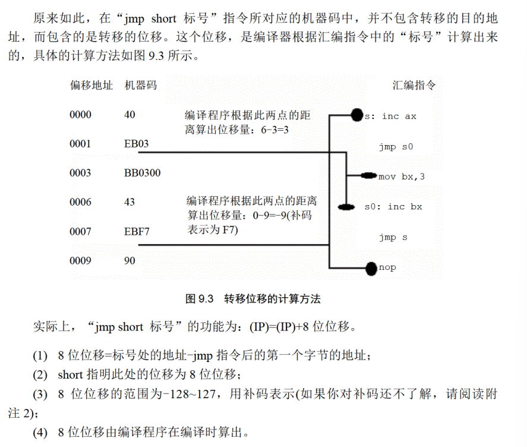
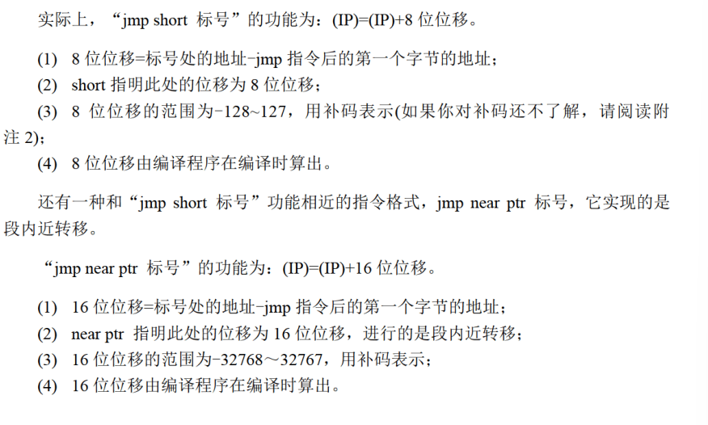

# 转移指令
可以修改IP或CS和IP的，统称为转移指令。

8086CPU 的转移行为有以下几类。
- 只修改P 时，称为段内转移，比如: jmp ax。
- 同时修改 CS 和P 时，称为段间转移，比如: jmp 1000:0

由于转移指令对 IP 的修改范围不同，段内转移又分为: 短转移和近转移
- 短转移 IPP 的修改范围为-128~127.
- 近转移 IP 的修改范围为-32768~32767。

8086CPU 的转移指令分为以下几类
- 无条件转移指令(如: jmmp)
- 条件转移指令
- 循环指令(如: loop)
- 过程
- 中断

## offset
取标号的偏移地址

## jmp
无条件跳转指令，只修改IP，也可以同时修改CS和IP

jmp必须给出的信息：
1. 转移的目的地址
2. 转移的距离

## jmp short
段内短转移，IP属于-128到127

CPU在执行jmp指令的时候并不需要转移的目的地址


## jmp near ptr


## jmp far ptr


## 监测点9.1
1. dw 0,0.0
2. offset start; cs
3. CS=0006,IP=00BE

## jcxz
有条件跳转，所有的有条件跳转指令，都是短转移。

## 监测点9.2
```
mov ch,0
mov cl,[bx]
jxcz ok
inc bx
```

## loop
之前已经讲过了

## 监测点9.3
```
inc cx
```
## 自动监测
如果转移的范围超过了边界，编译器会报错。
