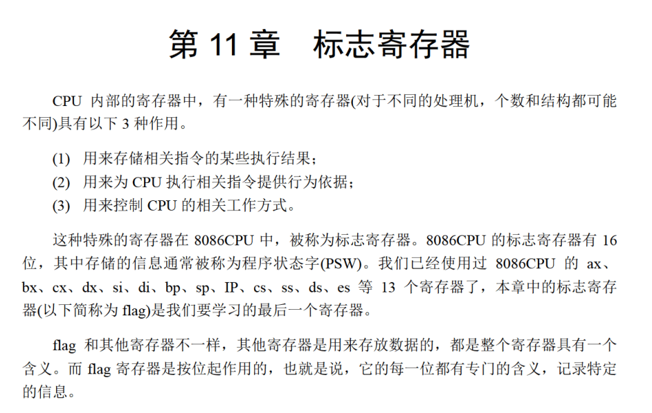
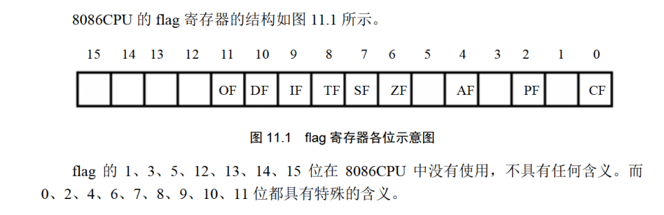
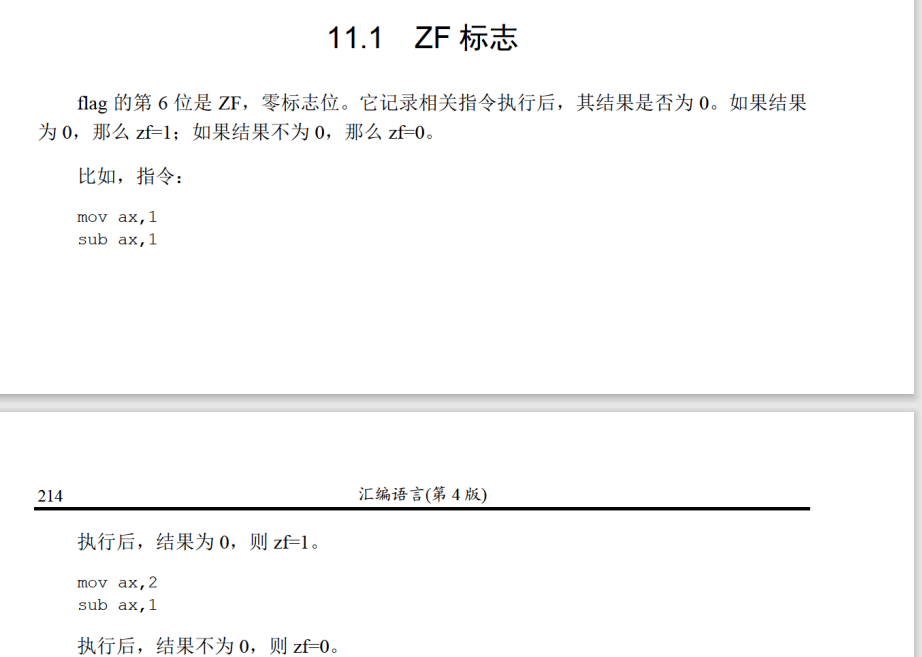
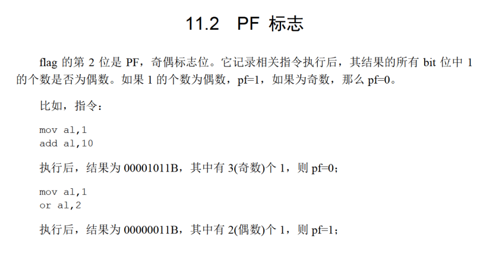
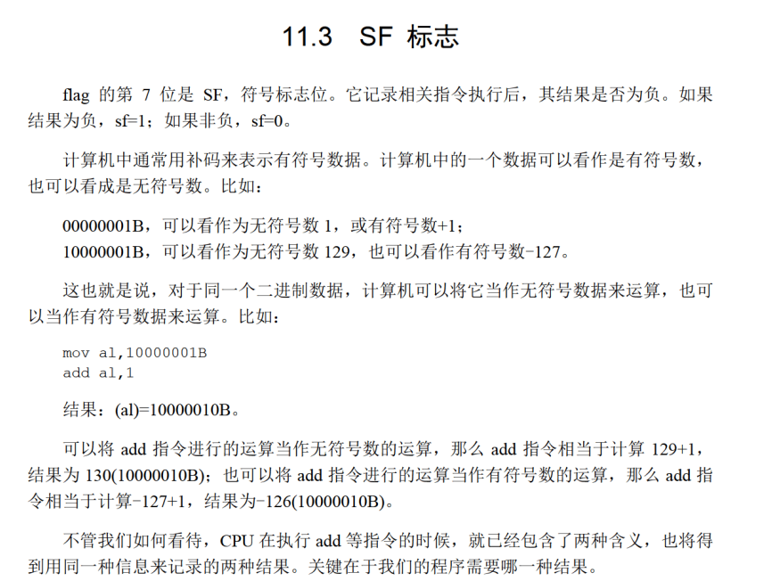
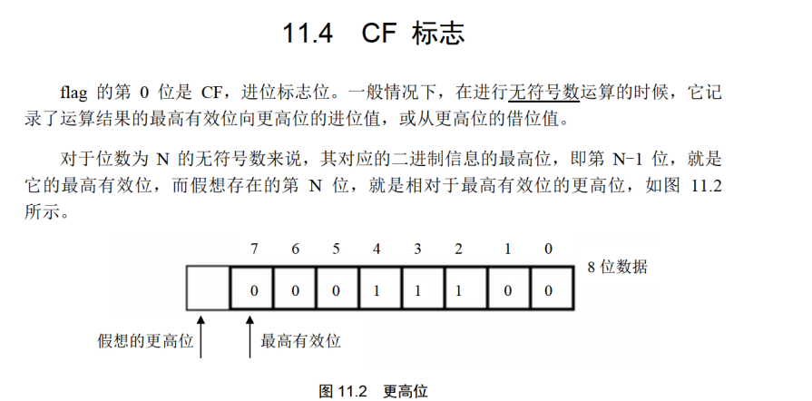
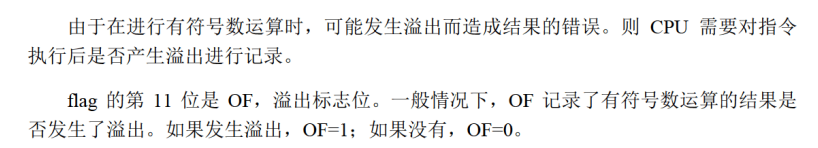

# FLAG


有用的


## ZF
ZF的值和结果是反着的


## PF

## SF

## CF

## OF


## 监测点11.1
```
                ZF   PF   SF
sub al,al       1    1    0		;结果为0，有0个为1的bit位，非负。
mov al,1        1    1    0		;传送指令不影响标志位。
push ax         1    1    0		;传送指令不影响标志位。
pop bx          1    1    0		;传送指令不影响标志位。
add al,bl       0    0    0		;结果为00000010B，结果不为0，有1个为1的bit位，非负。
add al,10       0    1    0		;结果为00001100B，结果不为0，有2个为1的bit位，非负。
mul al          0    1    0		;结果为10010000B，结果不为0，有2个为1的bit位，非负。

```
## 监测点11.2
```
 	CF	OF	SF	ZF	PF	分析
sub al,al	0	0	0	1	1	减法，结果为0，zf=1
mov al,10H	0	0	0	1	1
mov指令不改变标志位

add al,90H	0	0	1	0	1
结果A0H，未溢出，但是最高位是1，sf = 1    al = a0H

mov al,80H	0	0	1	0	1	~
add al,80H	1	1	0	1	1	结果是 100H，溢出，此时 al = 00H
mov al,0FCH	1	1	0	1	1	~
add al,05H	1	0	0	0	0	 结果101H，al = 01H
mov al,7DH	1	0	0	0	0	~
add al,0BH	0	1	1	0	1	无符号数运算，al=88H，没有进位， CF = 0；有符号数运算，因为7DH=1111101，是正数125，0BH是正数11，相加为136，超过128，OF=1
```