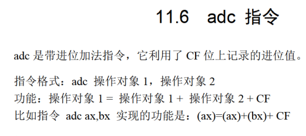
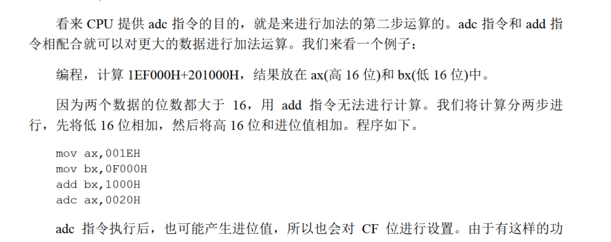
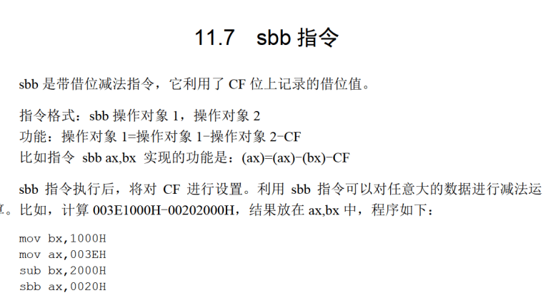
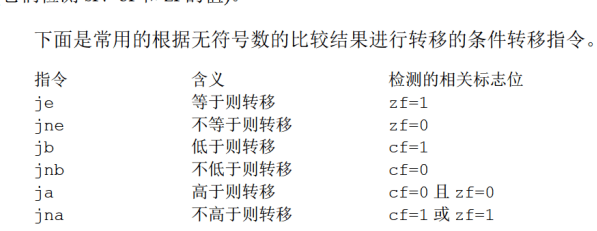
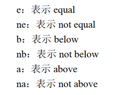
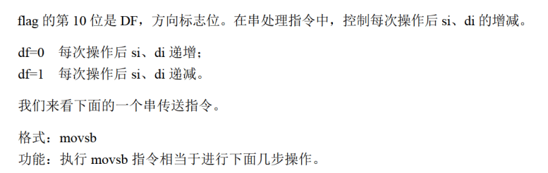
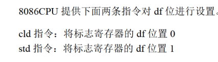
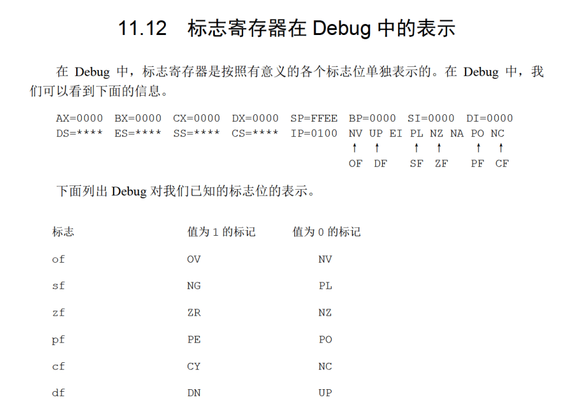

# 两个指令
ADC SBB





# CMP


作用是改变FLAG

# 跳转指令


j是JUMP，后面的字母是：



## 监测点11.3
1.
```
mov ax,0f000h
mov ds,ax

mov bx,0
mov dx,0
mov cx,32

s:
  mov al,[bx]
  cmp al,32
  jb s0
  cmp al,128
  ja s0
  inc dx

s0:
  inc bx
  loop s


```
2.
```
mov ax,0f000h
mov dx,ax

mov bx,0
mov dx,0
mov cx,32
s:
  mov al,[bx]
  cmp al,32
  jna s0
  cmp al,128
  jnb s0
  inc dx

s0:
  inc bx
  loop s
```
# DF 和 串指令


## 串指令
movsb movsw

把ds:si的内容复制到es:di之中，然后si di同时加或者减一

与rep配合使用

```
rep movsb
```

## 如何设置df?


# PUSHF & POPF
把FLAGS进行入栈和出栈操作
## 检测点11.4
```
mov ax,0
push ax
popf
mov ax,0fff0h
add ax,0010h
pushf
pop ax
and al,11000101B
and ah,00001000B
```
第三条语句 popf 将栈中数据 0 弹出，并送入标志寄存器，此时标志位全部置零。
第四 / 五条语句，加法运算，0FFF0H + 0010H。对于有符号数的计算而言，(-16) + (16) = 0，无溢出，OF=0；对于无符号数的计算而言，(65520) + (16) = 65536，有向更高位的进位，CF=1。且 ZF=0，PF=1。
语句 pushf 将标志寄存器的内容入栈，此时标志寄存器的内容为 0000 0000 0100 0101，则后续出栈后 (AX)=0045H。
and al,11000101B 进行按位与运算，结果为 (AL)=0100 0101=45H；and ah,00001000B 进行按位与运算，结果为 (AH)=0000 0000H。所以，最终 (AX)=0045H。

# debug之中的表示
