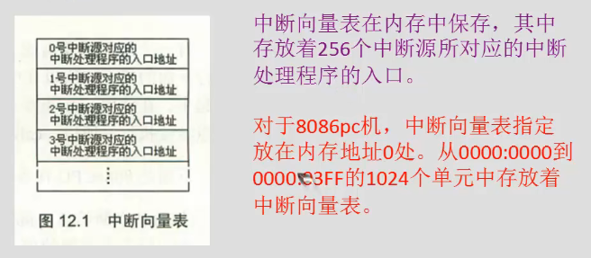

# 内中断
中断，一种需要立即去执行的特殊信息。

## 内中断的产生


## 中断处理程序
收到中断信息，如何处理，由自己编程。


## 中断向量表
中断向量表就是存中断向量的，存中断处理程序的入口



中断向量表在内存中存放，对于 8086PC 机，中断向量表指定放在内存地址 0 处。内存 0000:0000 到 0000:03EF 的 1024 个单元中存放着中断向量表。

那么在中断向量表中，一个表项占多大的空间呢?一个表项存放一个中断向量，也就是一个中断处理程序的入口地址，对于 8086CPU，这个入口地址包括段地址和偏移地址，所以一个表项占两个字，高地址字存放段地址，低地址字存放偏移地址。

## 监测点12.1
(1)用debug查看内存，情况如下：
0000:0000 68 10 A7 00 8B 01 70 00-16 00 9D 03 8B 01 70 00

解释：一个表项存放一个中断向量，也就是一个中断处理程序的入口地址，这个入口地址包括段地址和偏移地址，一个表项占两个字，高地址存放段地址，低地址存放偏移地址。所以可得
```
  0号：00A7：1068
  1号：0070：108B
  2号：039D：0016
  3号：0070：108B
```
(2)
存储N号中断源对应的中断处理程序入口的偏移地址的内存单元的地址为： 4N
存储N号中断源对应的中断处理程序入口的段地址的内存单元的地址为： 4N+2
## 中断过程


## 中断处理程序和iret
