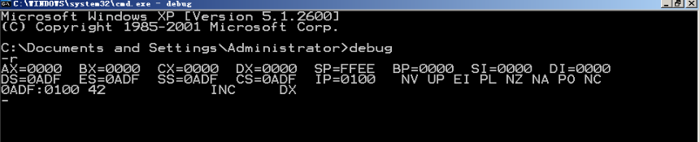
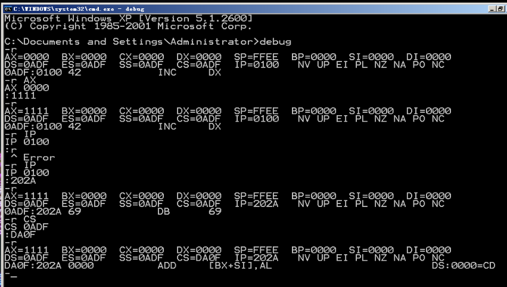
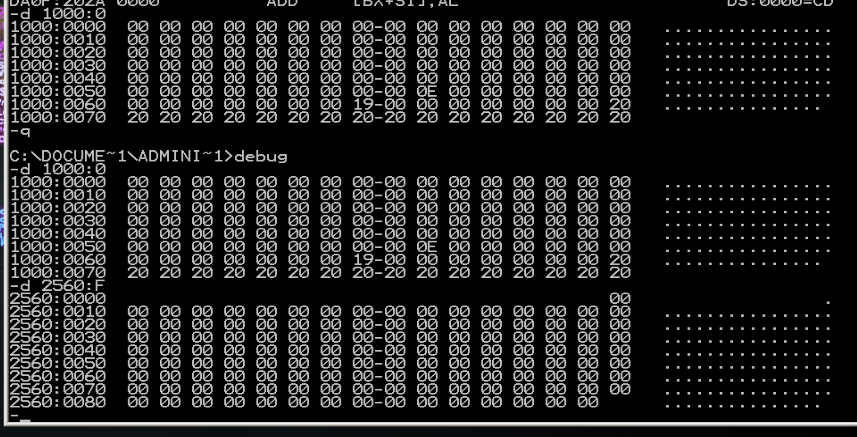
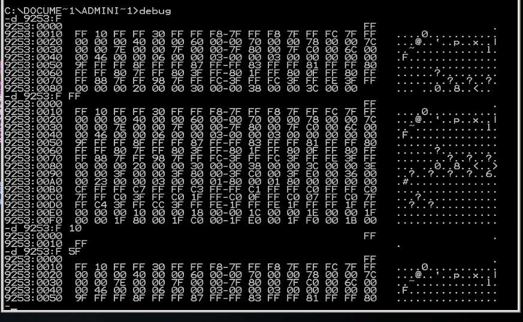
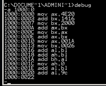
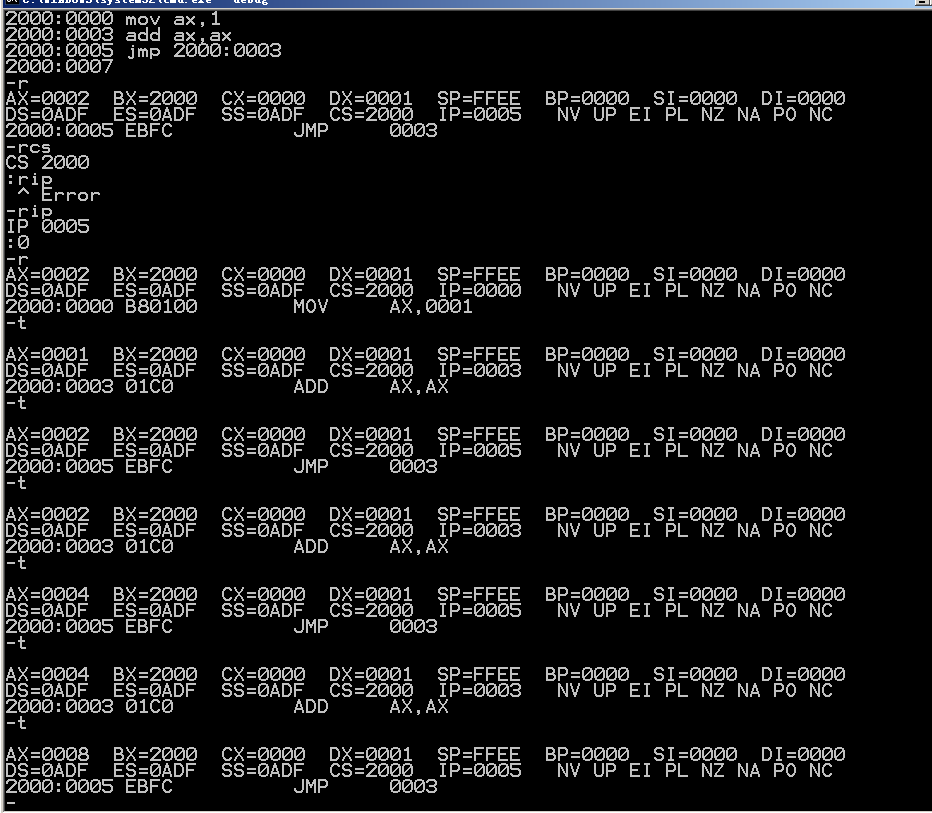
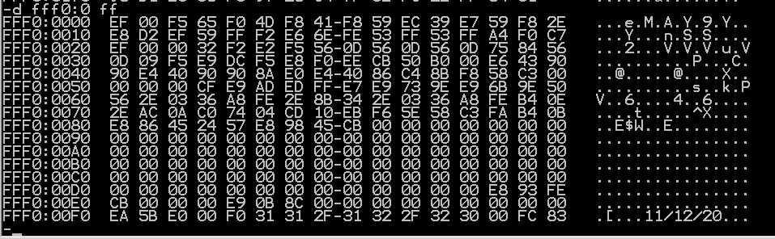

# Debug
一种Dos和windows7以前提供的调试工具，可以看寄存器内容、内存状态和机器码。
## 功能
用 Debug 的 R 命令查看、改变 CPU 寄存器的内容;
用 Debug 的 D 命令查看内存中的内容:
用 Debug 的 E 命令改写内存中的内容;
用 Debug 的 U 命令将内存中的机器指令翻译成汇编指令:
用 Debug 的 T 命令执行一条机器指令;
用 Debug 的 A 命令以汇编指令的格式在内存中写入一条机器指令

# 开始实验
我所使用的是吾爱破解XP虚拟机

首先输入r，查看各寄存器状态


基本的查看和改变寄存器状态


然后是使用d命令

```
d 段地址:偏移地址
```


可惜我这里什么也没看到

```
d 段地址:起始偏移地址 结尾偏移地址
```


e 命令可以改变数据内容


这里把前三个FF改成41,也就是十进制之下的65（A的ascii码）了

也可以按照提示模式逐步改写

u命令可以查看机器码对应的汇编指令，t命令可以执行

a命令则可以以汇编代码形式写入

### 问题1
```
mov ax,4E20
add bx,1416
mov bx,2000
add ax,bx
mov bx,ax
add ax,bx
mov ax,001A
mov bx,0026
add al,bl
add ah,bl
add bh,al
mov ah,0
add al,bl
add al,9c
```

结果：
```
机器码				汇编指令					运行结果		CS:IP
b8 20 43			mov ax,4E20H			ax=4E20		1000:0003
05 16 14			add ax,1416H			ax=6236		1000:0007
bb 00 20			mov bx,2000H			bx=2000		1000:000A
01 d8				add ax,bx				ax=8236		1000:000C
89 c3				mov bx,ax				bx=8236		1000:000E
01 d8				add ax,bx				ax=046C		1000:0000
b8 1a 00			mov ax,001AH			ax=001A		1000:0013
bb 26 00			mov bx,0026H			bx=0026		1000:0016
00 d8				add al,bl				ax=0040		1000:0018
00 dc				add ah,bl				ax=2640		1000:001A
00 c7				add bh,al				bx=4026		1000:001C
b4 00				mov ah,0				ax=0040		1000:001E
00 d8				add al,bl				ax=0066		1000:0020
04 9c				add al,9cH              ax=0002	    1000:0022

```
### 问题2

关键在于知道写在哪，那个JMP需要跳到add ax,ax这一句，然后反复加

### 问题3

找到了，但是改不了，因为ROM是只读存储器

### 问题4

输入以后有这些玩意儿

在8086PC机中A0000~BFFFF内存是显存地址空间。向地址A0000~BFFFF的内存单元中写数据，就是向显存中写入数据，这些数据会被显示卡输出到显示器上。

本题之中，在一个字(16位)中，低位字节决定了图案，高位字节决定了颜色
