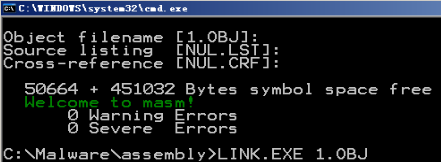
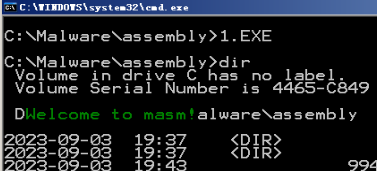
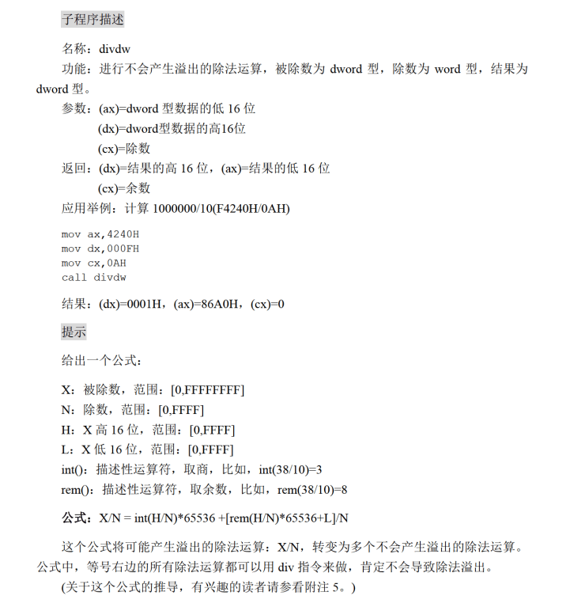
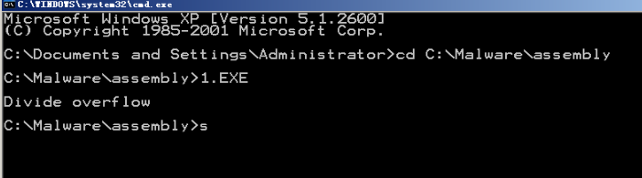
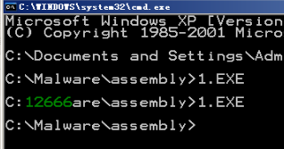
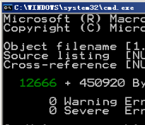

# 实验十
## 显示字符串
```
; name: show_str
; func: show a string at a given position with given color
; paras: dh,dl,cl

assume cs:code
data segment
    db 'Welcome to masm!',0
data ends

code segment
start:  mov dh,8
        mov dl,3
        mov cl,2
        mov ax,data
        mov ds,ax
        mov si,0
        call show_str

        mov ax,4c00h
        int 21h

show_str:
        mov ch,0
        mov bp,cx         ;保护cl

        mov ax,0b800h   ;显存空间首地址
        mov es,ax
        mov cl,dh
        mov ch,0
        dec cx
        sub bx,bx       ;先算行

    s:  add bx,00a0h
        loop s

        mov cl,dl
        sub di,di
        dec cx          ;再算列

    s1: add di,2
        loop s1

change: mov cl,[si]
        mov ch,0
        jcxz ok

        mov al,ds:[si]
        mov es:[bx+di],al
        mov ax,bp
        mov byte ptr es:[bx+di+1],al

        inc SI
        ADD DI,2
        jmp short change

    ok: ret


code ends
end start
```
看着像一个实验九的延续。



上图看起来是第七行？



只是显示问题。

### 存变量
```
assume cs:code
data segment
    db 'Welcome to masm!',0
data ends

code segment
start:  mov dh,8
        mov dl,3
        mov cl,2
        mov ax,data
        mov ds,ax
        mov si,0
        call show_str

        mov ax,4c00h
        int 21h

show_str:
        push cx
        push bx
        push ax
        push bp
        push di
        mov ch,0
        mov bp,cx         ;保护cl

        mov ax,0b800h   ;显存空间首地址
        mov es,ax
        mov cl,dh
        mov ch,0
        dec cx
        sub bx,bx       ;先算行

    s:  add bx,00a0h
        loop s

        mov al,DL
        MOV AH,0
        ADD AX,ax
        SUB AX,2          ;再算列
	MOV DI,ax

change: mov cl,[si]
        mov ch,0
        jcxz ok

        mov al,ds:[si]
        mov es:[bx+di],al
        mov ax,bp
        mov byte ptr es:[bx+di+1],al

        inc SI
        ADD DI,2
        jmp short change

    ok: pop di
        pop bp
        pop ax
        pop bx
        pop cx
        ret

code ends
end start
```
## 解决除法溢出问题

请仔细阅读提示，要是没提示这题想半天。

这题抄了这个[解答](https://blog.csdn.net/Dr_Cheeze/article/details/127515082)
```
assume cs:code,ss:stack
stack segment
    dw 8 dup(0)
stack ends

code segment
start:
    mov sp,10H

    mov ax,4240H    ;被除数的低16位
    mov dx,000FH    ;被除数的高16位
    mov cx,0AH    ;除数
    call divdw    ;调用子程序

divdw:

    push bx    ;bx是额外用到的寄存器，要压入栈

    mov bx,ax    ;bx=L
    mov ax,dx    ;ax=H
    mov dx,0    ;dx=0
    div cx        ;计算H/N，结果的商即int(H/N)保存在ax，余数即rem(H/N)保存在dx

                    ;接下来要计算int(H/N)*65536，思考一下，65536就是0001 0000 H，
                    ;因此计算结果就是，高16位=int(H/N)，低16位为0000H。

    push ax        ;将int(H/N)*65536结果的高16位，即int(H/N)，压入栈
    mov ax,0
    push ax        ;将int(H/N)*65536结果的低16位，即0000H，压入栈

                    ;接下来要计算 rem(H/N)*65536 ，同理可得，
                    ;计算结果为 高16位=  rem(H/N)*65536 ，即此时dx的值，
                    ;低16位为 0000H。

    mov ax,bx    ;ax = bx = L ，即 [rem(H/N)*65536 + L]的低16位
    div cx        ;计算 [rem( H/N) * 65536 + L]/N ，结果的商保存在ax，余数保存在dx

                    ;接下来要将两项求和。  左边项的高、低16位都在栈中，
                    ;其中高16位就是最终结果的高16位，低16位是0000H。
                    ;右边项的商为16位，在ax中，也就是最终结果的低16位，
                    ;余数在dx中，也就是最终结果的余数。

    mov cx,dx    ;cx = 最终结果的余数
    pop bx        ;cx = int(H/N)*65536结果的低16位，即0000H。
    pop dx        ;bx = int(H/N)*65536结果的高16位，即最终结果的高16位

    pop bx    ;还原bx的值

    mov ax,4c00H
    int 21H
code ends
end start
```
## 数值显示
### 问题版本
```
assume cs:code,ds:data,ss:stack
data segment
    db 10 dup(0)
data ends

stack segment
    dw 16 dup(0)    ;32字节
stack ends

code segment
start:

    mov ax,12666    ;要显示的数据
    MOV BX,DATA
    MOV DS,BX
    mov si,0    ;ds:si指向字符串首地址
    call dtoc    ;将数据转为十进制字符

    mov dh,8    ;在屏幕第几行开始显示
    mov dl,3    ;在屏幕第几列开始显示
    mov cl,2    ;显示的字符的颜色
    call show_str

    mov ax,4c00H    ;程序返回
    int 21H


dtoc:    ;功能：将给定的word型数据转为十进制字符形式，存入data段，首地址ds:si
            ;参数：ax 指定的word数据
            ;返回：ds:si指向data段字符串首地址
        PUSH AX
        PUSH BX
        PUSH CX

        MOV BL,0AH
        MOV BH,0
        MOV CH,0

PUSHREMAINDER:
        DIV BL
        MOV CL,AL
        JCXZ POPREMAINDER
        PUSH AX
        INC BH
        JMP SHORT PUSHREMAINDER

POPREMAINDER:
        MOV CL,BH

    S1: POP AX
        ADD AH,30H
        MOV DS:[SI],AH
        LOOP S1

        POP CX
        POP BX
        POP AX
        RET

show_str:
        push cx
        push bx
        push ax
        push bp
        push di
        mov ch,0
        mov bp,cx         ;保护cl

        mov ax,0b800h   ;显存空间首地址
        mov es,ax
        mov cl,dh
        mov ch,0
        dec cx
        sub bx,bx       ;先算行

    s:  add bx,00a0h
        loop s

        mov al,DL
        MOV AH,0
        ADD AX,ax
        SUB AX,2          ;再算列
	MOV DI,ax

change: mov cl,[si]
        mov ch,0
        jcxz ok

        mov al,ds:[si]
        mov es:[bx+di],al
        mov ax,bp
        mov byte ptr es:[bx+di+1],al

        inc SI
        ADD DI,2
        jmp short change

    ok: pop di
        pop bp
        pop ax
        pop bx
        pop cx
        ret
code ends
end start
```


这里可以看出要用到上一题的除法
### 正确答案
这里第二题的答案我用了上一题别人写的程序，他那个写的很好，我不动了。
```
assume cs:code,ds:data,ss:stack
data segment
    db 10 dup(0)
data ends

stack segment
    dw 16 dup(0)    ;32字节
stack ends

code segment
start:

    mov ax,12666    ;要显示的数据
    MOV BX,DATA
    MOV DS,BX
    mov si,0    ;ds:si指向字符串首地址
    call dtoc    ;将数据转为十进制字符

    mov dh,8    ;在屏幕第几行开始显示
    mov dl,3    ;在屏幕第几列开始显示
    mov cl,2    ;显示的字符的颜色
    call show_str

    mov ax,4c00H    ;程序返回
    int 21H


dtoc:    ;功能：将给定的word型数据转为十进制字符形式，存入data段，首地址ds:si
            ;参数：ax 指定的word数据
            ;返回：ds:si指向data段字符串首地址
        PUSH AX
        PUSH BX
        PUSH CX
        PUSH DX
        PUSH SI
        SUB BX,BX

PUSHREMAINDER:
        MOV CX,0AH
        MOV DX,0
        CALL DIVDW

        ADD AX,DX
        MOV DX,CX
        MOV CX,AX
        PUSH DX
        INC BX
        JCXZ POPREMAINDER
        JMP SHORT PUSHREMAINDER

POPREMAINDER:
        MOV CX,BX

    S1: POP AX
        ADD AL,30H
        MOV DS:[SI],AL
        INC SI
        LOOP S1
	    POP SI
        POP DX
        POP CX
        POP BX
        POP AX
        RET
divdw:

    push bx    ;bx是额外用到的寄存器，要压入栈

    mov bx,ax    ;bx=L
    mov ax,dx    ;ax=H
    mov dx,0    ;dx=0
    div cx        ;计算H/N，结果的商即int(H/N)保存在ax，余数即rem(H/N)保存在dx

                    ;接下来要计算int(H/N)*65536，思考一下，65536就是0001 0000 H，
                    ;因此计算结果就是，高16位=int(H/N)，低16位为0000H。

    push ax        ;将int(H/N)*65536结果的高16位，即int(H/N)，压入栈
    mov ax,0
    push ax        ;将int(H/N)*65536结果的低16位，即0000H，压入栈

                    ;接下来要计算 rem(H/N)*65536 ，同理可得，
                    ;计算结果为 高16位=  rem(H/N)*65536 ，即此时dx的值，
                    ;低16位为 0000H。

    mov ax,bx    ;ax = bx = L ，即 [rem(H/N)*65536 + L]的低16位
    div cx        ;计算 [rem( H/N) * 65536 + L]/N ，结果的商保存在ax，余数保存在dx

                    ;接下来要将两项求和。  左边项的高、低16位都在栈中，
                    ;其中高16位就是最终结果的高16位，低16位是0000H。
                    ;右边项的商为16位，在ax中，也就是最终结果的低16位，
                    ;余数在dx中，也就是最终结果的余数。

    mov cx,dx    ;cx = 最终结果的余数
    pop bx        ;cx = int(H/N)*65536结果的低16位，即0000H。
    pop dx        ;bx = int(H/N)*65536结果的高16位，即最终结果的高16位

    pop bx    ;还原bx的值
    ret

show_str:
        push cx
        push bx
        push ax
        push bp
        push di
        mov ch,0
        mov bp,cx         ;保护cl

        mov ax,0b800h   ;显存空间首地址
        mov es,ax
        mov cl,dh
        mov ch,0
        dec cx
        sub bx,bx       ;先算行

    s:  add bx,00a0h
        loop s

        mov al,DL
        MOV AH,0
        ADD AX,ax
        SUB AX,2          ;再算列
	MOV DI,ax

change: mov cl,DS:[si]
        mov ch,0
        jcxz ok

        mov al,ds:[si]
        mov es:[bx+di],al
        mov ax,bp
        mov byte ptr es:[bx+di+1],al

        inc SI
        ADD DI,2
        jmp short change

    ok: pop di
        pop bp
        pop ax
        pop bx
        pop cx
        ret
code ends
end start
```

### 网友答案
和上面的解答抄了同一个
```
assume cs:code,ds:data,ss:stack
data segment
    db 10 dup(0)
data ends

stack segment
    dw 16 dup(0)    ;32字节
stack ends

code segment
start:
    mov bx,data    ;设置ds段地址
    mov ds,bx
    mov bx,stack    ;设置栈顶
    mov ss,bx
    mov sp,20H

    mov ax,12666    ;要显示的数据
    mov si,0    ;ds:si指向字符串首地址
    call dtoc    ;将数据转为十进制字符

    mov dh,8    ;在屏幕第几行开始显示
    mov dl,3    ;在屏幕第几列开始显示
    mov cl,2    ;显示的字符的颜色
    call show_str

    mov ax,4c00H    ;程序返回
    int 21H


dtoc:    ;功能：将给定的word型数据转为十进制字符形式，存入data段，首地址ds:si
            ;参数：ax 指定的word数据
            ;返回：ds:si指向data段字符串首地址

    push bx;    ;将子程序用到的寄存器压入栈
    push cx;
    push dx;
    push si;

    mov bx,000aH    ;bl = 除数，bh = 一共除了几次
    mov dx,0    ;即将进行除法，dx是高16位，低16位在ax中

    pushyushu:
    mov cx,0
    mov cl,bl    ;cx = 除数
    call divdw    ;调用不会溢出的除法函数，结果的商的高16位，在dx中，
                    ;低16位在ax中，余数在cx中，余数一定<10

    push cx        ;cx=余数，这个余数在显示的时候要倒序显示，因此先压入栈
    inc bh        ;记录将余数压入栈的次数
    mov cx,ax    ;cx = ax = 结果的商的低16位
    add cx,dx    ;dx是结果的商的高16位，ax和dx一定都是非负数
    jcxz popyushu        ;若cx=0，则说明除法计算已经完毕，跳转下一步执行
    jmp short pushyushu

    popyushu:
    mov ch,0
    mov cl,bh    ;ch=0，所以cx = 将余数压入栈的次数，也就是接下来的循环次数
    s1:
    pop ax;        ;从栈中pop出一个余数
    add ax,30H    ;从数字转为对应的数字字符
    mov ds:[si],al    ;用al就够了
    inc si
    loop s1

    pop si    ;子程序结束，将寄存器的值pop出来
    pop dx;
    pop cx;
    pop bx;

    ret

divdw:    ;功能：计算word型被除数与byte型除数的除法
            ;参数：  ax=被除数低16位，dx=被除数高16位，cx = 除数
            ;返回：  ax=商的低16位，dx=商的高16位，cx = 余数

    ;计算公式： X/N = int( H/N ) * 65536 + [rem( H/N) * 65536 + L]/N
    ;其中X为被除数，N为除数，H为被除数的高16位，L为被除数的低16位，
    ;int()表示结果的商，rem()表示结果的余数。

    push bx    ;bx是额外用到的寄存器，要压入栈

    mov bx,ax    ;bx=L
    mov ax,dx    ;ax=H
    mov dx,0    ;dx=0
    div cx        ;计算H/N，结果的商即int(H/N)保存在ax，余数即rem(H/N)保存在dx

                    ;接下来要计算int(H/N)*65536，思考一下，65536就是0001 0000 H，
                    ;因此计算结果就是，高16位=int(H/N)，低16位为0000H。

    push ax        ;将int(H/N)*65536结果的高16位，即int(H/N)，压入栈
    mov ax,0
    push ax        ;将int(H/N)*65536结果的低16位，即0000H，压入栈

                    ;接下来要计算 rem(H/N)*65536 ，同理可得，
                    ;计算结果为 高16位=  rem(H/N)*65536 ，即此时dx的值，
                    ;低16位为 0000H。

    mov ax,bx    ;ax = bx = L ，即 [rem(H/N)*65536 + L]的低16位
    div cx        ;计算 [rem( H/N) * 65536 + L]/N ，结果的商保存在ax，余数保存在dx

                    ;接下来要将两项求和。  左边项的高、低16位都在栈中，
                    ;其中高16位就是最终结果的高16位，低16位是0000H。
                    ;右边项的商为16位，在ax中，也就是最终结果的低16位，
                    ;余数在dx中，也就是最终结果的余数。

    mov cx,dx    ;cx = 最终结果的余数
    pop bx        ;cx = int(H/N)*65536结果的低16位，即0000H。
    pop dx        ;bx = int(H/N)*65536结果的高16位，即最终结果的高16位

    pop bx    ;还原bx的值

    ret


show_str:
                ;功能：将data段中首地址为ds:si的字符，以指定颜色显示在屏幕指定位置
                ;参数：dh 行号， dl 列号 ，cl 颜色
                ;返回：无

    push dx        ;将子程序用到的寄存器压入栈
    push si
    push ax
    push bx

    mov ax,0B800H    ;设置es为显示区段地址
    mov es,ax

    mov ax,00A0H    ;设置首字符显示的地址
    mul dh
    mov dh,0
    add ax,dx
    add ax,dx
    sub ax,2
    mov bx,ax    ;bx是显示区的偏移地址

    mov al,cl    ;用al存储属性字节
    mov ch,0
    mov si,0

    s:                ;循环读取字符并显示
    mov cl,ds:[si]
    jcxz ok            ;若读到0，就退出循环
    mov es:[bx],cl
    inc bx
    mov es:[bx],al
    inc bx
    inc si
    jmp short s

    ok:        ;将寄存器的值pop出来
    pop bx
    pop ax
    pop si
    pop dx

    ret    ;返回


code ends
end start
```
注意他这个里面，对列的计算应该减2.



正确结果如上图所示。

