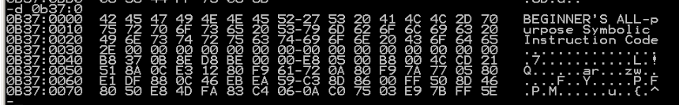
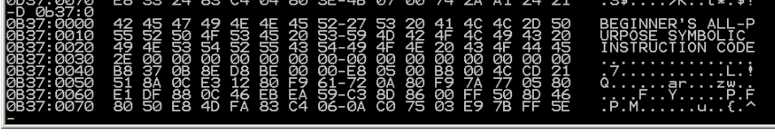

# 实验十一
把字符串里所有的小写字母转为大写字母。

```
assume cs:code

datasg segment
    db "Beginner's ALL-purpose Symbolic Instruction Code.",0
datasg ends

code segment
begin:  mov ax,datasg
        mov ds,ax
        mov si,0
        call letterc

        mov ax,4c00h
        int 21h

letterc:
        push cx

    start:
        mov cl,ds:[si]
        jcxz finish
        cmp cl,61H
        jb ok
        cmp cl,7Ah
        ja ok
        and cl,0DFH
        mov ds:[si],cl

    ok: inc si
        jmp short start
    finish:
        pop cx
        ret

code ends
end begin
```





好水的实验