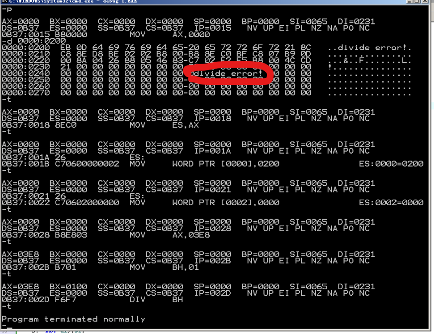
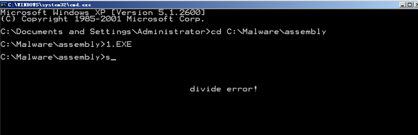

# 实验十二
1. do0程序放在哪？放在0000:2000-0000:02FF之中
2. do0的入口地址，放在中断向量表0号表项
3. 如何获取代码长度？编译器来做！利用offset计算
4. overflow!应该在哪？在cs之中！
```
assume cs:code

code segment
start:  mov ax,cs
        mov ds,ax
        mov si,offset do0
        mov ax,0
        mov es,ax
        mov di,200h
        mov cx,offset do0end-offset do0
        cld
        rep movsb
        ;上面的步骤把整个do0复制到了0000:0200开始的内存空间之中

        mov ax,0
        mov es,ax

        mov word ptr es:[0*4],200h
        mov word ptr es:[0*4+2],0
        ;这几行把0号中断的中断处理程序的入口点设置为了0000:0200

        ;接下来试验一下
        mov ax,1000
        mov bh,01
        div bh

        mov ax,4c00h
        int 21h

    do0:
        jmp short do0start
        db "divide error!"
    do0start:
        mov ax,cs
        mov ds,ax
        mov si,202h

        mov ax,0b800h
        mov es,ax
        mov di,12*160+36*2

        mov cx,13
    s:  mov al,[si]
        mov es:[di],al
        inc si
        add di,2
        loop s

        mov ax,4c00h
        int 21h
    do0end:
        nop

code ends
end start
```




实验成功！