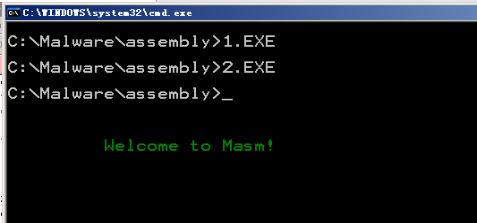
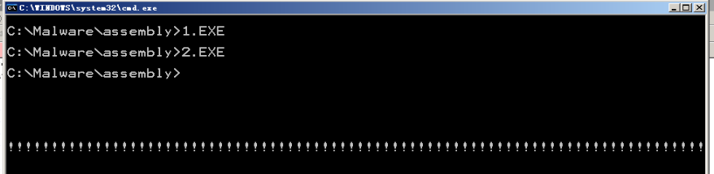

# 编写、应用中断程序
## 编写并安装int 17h中断程序
又是缝合性实验
```
assume cs:code

code segment
start:  mov ax,cs
        mov ds,ax
        mov si,offset show_str
        mov ax,0
        mov es,ax
        mov di,200h
        mov cx,offset show_str_end-offset show_str
        cld
        rep movsb
        ;上面的步骤把整个do0复制到了0000:0200开始的内存空间之中

        mov ax,0
        mov es,ax

        mov word ptr es:[7ch*4],200h
        mov word ptr es:[7ch*4+2],0
        ;这几行把0号中断的中断处理程序的入口点设置为了0000:0200
        mov ax,4c00h
        int 21h

show_str:
        mov ch,0
        mov bp,cx         ;保护cl

        mov ax,0b800h   ;显存空间首地址
        mov es,ax
        mov cl,dh
        mov ch,0
        dec cx
        sub bx,bx       ;先算行

    s:  add bx,00a0h
        loop s

        mov cl,dl
        sub di,di
        dec cx          ;再算列

    s1: add di,2
        loop s1

change: mov cl,[si]
        mov ch,0
        jcxz ok

        mov al,ds:[si]
        mov es:[bx+di],al
        mov ax,bp
        mov byte ptr es:[bx+di+1],al

        inc SI
        ADD DI,2
        jmp short change

    ok: iret
show_str_end:nop
code ends
end start
```
很简单的东东hhh
```
assume cs:code
data segment
    db 'Welcome to Masm!',0
data ends
code segment
start:
    mov dh,10
    mov dl,10
    mov cl,2
    mov ax,data
    mov ds,ax
    mov si,0
    int 7ch
    mov ax,4c00h
    int 21h
code ends
end start
```



可以看到成功！
## 7ch的中断程序模拟循环
```
assume cs:code
code segment
start:
	mov ax,0b800h
	mov es,ax
	mov di,160*12
	mov bx,offset s-offset se 				;设置从标号se到标号s的转移位移
	mov cx,80
s:
	mov byte ptr es:[di],'!'
	add di,2
	int 7ch									;如果(cx)≠0，转移到标号s处
se:
	nop
	mov ax,4c00h
	int 21h
code ends
end start
```
而中断程序，书里几乎都给出了
```
assume cs:code
code segment

start:
	mov ax,cs
	mov ds,ax
	mov si,offset lp
	mov ax,0
	mov es,ax
	mov di,200h
	mov cx,offset lpred-offset lp
	cld
	rep movsb

	;设置中断向量表
	mov ax,0
	mov es,ax
	mov word ptr es:[7ch*4],200h
	mov word ptr es:[7ch*4+2],0

	mov ax,4c00h
	int 21h

lp:
	push bp
	mov bp,sp
	dec cx
	jcxz lpret
	add [bp+2],bx
lpret:
	pop bp
	iret
lpred:
	nop

code ends
end start
```

## 填空
看一下10号中断是咋回事儿即可

1. ds:[si]
2. ds:[bx]
3. inc si
4. add bx,2