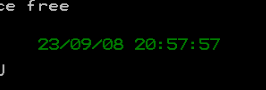

# 访问CMOS RAM
```
assume cs:code

data segment
    db 'yy/mm/ss hh:mm:ss', 0   ;输出模板
data ends
code segment
 start:
        mov ax, data
        mov ds, ax
        mov si, 0               ;初始化输出模板

        mov bx, 9               ;方便循环操作
        mov dx, 3               ;计数
        mov cl, 4

    y_m_s:
        mov al, bl
        out 70h, al             ;给70h端口送入9,访问CMOS-9号地址
        in al, 71h              ;拿出9号地址中间的内容
        mov ah, al
        call handle

        dec bx
        dec dx

        cmp dx, 0               ;判断循环是否结束
        je h_m_s_start

        jmp short y_m_s

    h_m_s_start:
        mov bx, 4
        mov dx, 3

    h_m_s:
        mov al, bl
        out 70h, al
        in al, 71h
        mov ah, al

        call handle
        sub bx, 2
        dec dx

        cmp dx, 0
        je print_str_start
        jmp short h_m_s

        print_str_start:
        mov dh,12
        mov dl,38
        mov cl,2
        mov ax,data
        mov ds,ax
        mov si,0
        call show_str

        mov ax, 4c00h
        int 21h

handle:
        shr ah, cl              ;只需要前面4个字节
        and al, 00001111b       ;只需要后面4个字节

        add ah, 30h
        add al, 30h

        mov [si], ah            ;放入模板字符串中
        mov [si+1], al
        add si, 3
        ret
show_str:
        mov ch,0
        mov bp,cx         ;保护cl

        mov ax,0b800h   ;显存空间首地址
        mov es,ax
        mov cl,dh
        mov ch,0
        dec cx
        sub bx,bx       ;先算行

    s:  add bx,00a0h
        loop s

        mov cl,dl
        sub di,di
        dec cx          ;再算列

    s1: add di,2
        loop s1

change: mov cl,[si]
        mov ch,0
        jcxz ok

        mov al,ds:[si]
        mov es:[bx+di],al
        mov ax,bp
        mov byte ptr es:[bx+di+1],al

        inc SI
        ADD DI,2
        jmp short change

    ok: ret

code ends
end start
```


改了一下网友的答案，没啥兴趣写了。