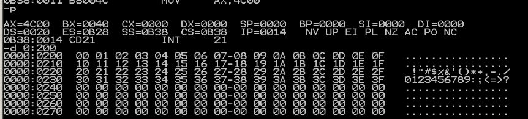
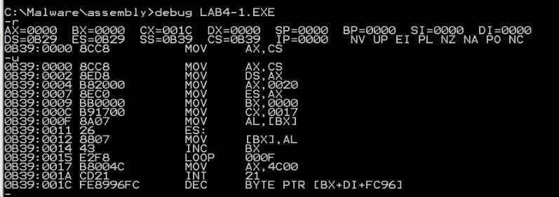
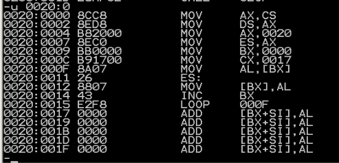

# lab4
## 向内存0:200~0:23F依次传递数据0~63
```
assume cs:code
code segment
    mov ax,0020H
    mov ds,ax
    mov bx,0000H
    mov cx,0040H
s:  mov [bx],bl
    inc bl
    loop s
    mov ax,4c00H
    int 21H
code ends
end
```
这里，bl是否使用用无所谓，因为是小段存储。
## 向内存0:200~0:23F依次传递数据0~63，只允许使用九条指令，包括mov ax,4c00h和int 21h
代码与上一题相同

最重要的就是复用寄存器。


最后结果，可见实验成功。
## 下面的程序的功能是将“mov ax,4c00h”之前的指令复制到内存0~0:200处，补全程序。上机调试，跟踪运行结果。
```
assume cs:code

code segment
	mov ax,cs
	mov ds,ax
	mov ax,0020h
	mov es,ax
	mov bx,0
	mov cx,23

s:
	mov al,[bx]
	mov es:[bx],al
	inc bx
	loop s
	mov ax,4c00h
	int 21h
code ends
end
```

提示：
(1)复制的是什么？从哪里到哪里？
答：复制的是程序的指令，从“mov ax,cs”开始到“loop s”。
(2)复制的什么？有多少个字节？你如何知道要复制的字节的数量
复制的是程序的指令，先运行程序，根据CX寄存器的值知道程序的长度(字节)。然后在减去从"mov ax,4c00h"指令开始的程序长度。


本题的难度在于不知道机器码有长，可以随便填一个数先进去看然后再改

可以发现复制成功

