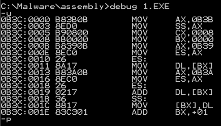
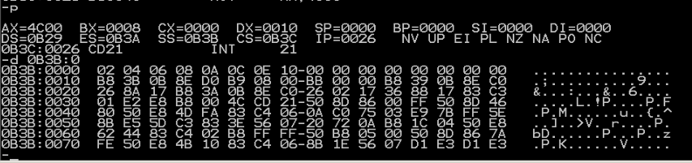

# 实验五
## 第一问
```
assume cs:code,ds:data,ss:stack
data segment
    dw 0123h,0456h,0789h,0abch,0defh,0fedh,0cbah,0987h
data ends

stack segment
    dw 0,0,0,0,0,0,0,0
stack ends

code segment
start:  mov ax,stack
        mov ss,ax
        mov sp,16

        mov ax,data
        mov ds,ax

        push ds:[0]
        push ds:[2]
        pop ds:[2]
        pop ds:[0]

        mov ax,4c00h
        int 21h
code ends
end start
```

1. data没有变化
2. CS=0B3B,SS=0B3A ,DS=0B39
3. 程序加载后，code段地址设为X，则data段地址为X-2,stack段的段地址为X-1.
## 第二问
```
assume cs:code,ds:data,ss:stack
data segment
    dw 0123h,0456h
data ends

stack segment
    dw 0,0
stack ends

code segment
start:  mov ax,stack
        mov ss,ax
        mov sp,16

        mov ax,data
        mov ds,ax

        push ds:[0]
        push ds:[2]
        pop ds:[2]
        pop ds:[0]

        mov ax,4c00h
        int 21h
code ends
end start
```
本题的重点在于：数据段和栈段在程序加载后实际占据的空间都是以16个字节为单位的。程序中只给出了前两个字数据，其余空间都用0填充。
1. data不变
2. CS=0B3B,SS=0B3A ,DS=0B39
3. 程序加载后，code段地址设为X，则data段地址为X-2,stack段的段地址为X-1.
4. 实际占有的空间为：$$(N+15)/16*16$$

## 第三问
```
assume cs:code,ds:data,ss:stack

code segment
start:  mov ax,stack
        mov ss,ax
        mov sp,16

        mov ax,data
        mov ds,ax

        push ds:[0]
        push ds:[2]
        pop ds:[2]
        pop ds:[0]

        mov ax,4c00h
        int 21h
code ends

data segment
    dw 0123h,0456h
data ends

stack segment
    dw 0,0
stack ends
end start
```

1. data不变
2. CS=0B39,SS=0B3D ,DS=0B3C
3. 程序加载后，code段地址设为X，则data段地址为X+3,stack段的段地址为X+4.

## 第四问
只有三，因为不指定会从第一个段开始。
## 第五问
这里，不能把c当栈用，下一题可以
```
assume cs:code
a segment
    db 1,2,3,4,5,6,7,8
a ends

b segment
    db 1,2,3,4,5,6,7,8
b ends

c segment
    db 0,0,0,0,0,0,0,0
c ends

code segment
start:
        mov ax,c
        mov ss,ax

        mov cx,8
        mov bx,0

    s:  mov ax,a
        mov es,ax
        mov dl,es:[bx]
        mov ax,b
        mov es,ax
        add dl,es:[bx]
        mov ss:[bx],dl
        inc bx
        loop s

        mov ax,4c00h
        int 21h
code ends
end start
```

a的地址是0B39,b的地址是0B3A，c的地址是0B3B。可以看到成功了

总感觉写贼鸡儿麻烦呢。。。
## 第六问
这个巨简单，就不停往下压栈就行。
```
assume cs:code
a segment
    dw 1,2,3,4,5,6,7,8,9,0ah,0bh,0ch,0dh,0eh,0fh,0ffh
a ends

b segment
    dw 0,0,0,0,0,0,0,0
b ends

code segment
start:	mov ax,b
		mov ss,ax
		mov sp,10h	;拿b当栈用

		mov ax,a
		mov es,ax

		mov bx,0

		mov cx,8
s:		push es:[bx]
		add bx,2
		loop s

    	mov ax,4c00h
    	int 21h

code ends
end start
```