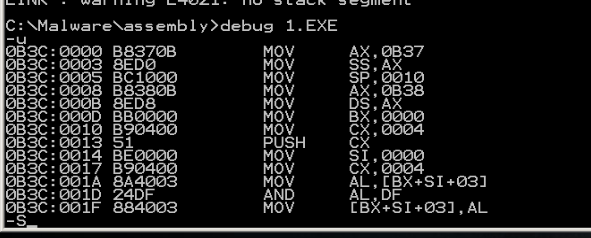
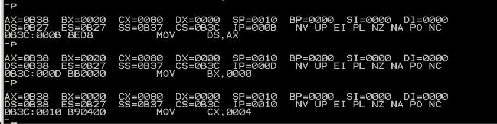
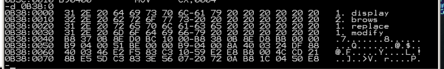
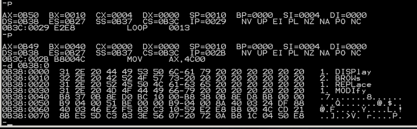

# 编程
```
assume cs:codesg,ss:stacksg,ds:datasg
stacksg segment
    dw 0,0,0,0,0,0,0,0
stacksg ends

datasg segment
    db '1. display      '
    db '2. brows        '
    db '1. replace      '
    db '1. modify       '
datasg ends

codesg segment
    start:  mov ax,stacksg
            mov ss,ax
            mov sp,16;define a stack

            mov ax,datasg
            mov ds,ax
            mov bx,0;begin at line 0

            mov cx,4
        s0: push cx
            mov si,0; column begins at 3
            mov cx,4
        s:  mov al,[bx+3+si]
            and al,11011111B
            mov [bx+3+si],al
            inc si
            loop s

            add bx,16
            pop cx
            loop s0

            mov ax,4c00H
            int 21H
codesg ends

end start
```


看一下原始的内容，数据段在0B38



可以看到成功！

