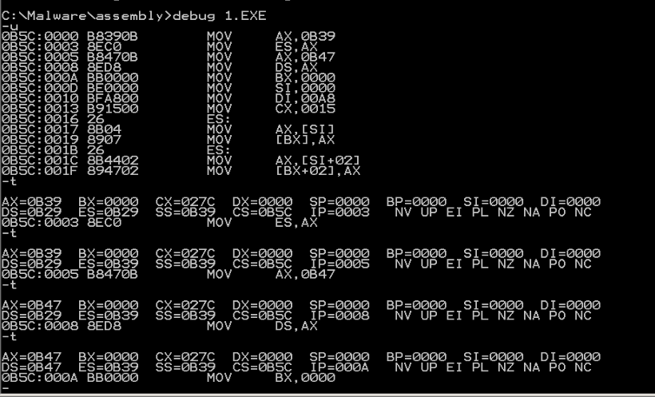
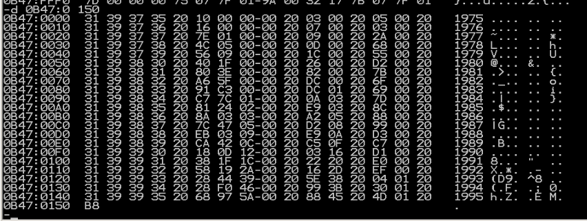

# 编程
```
assume cs:codesg,ds:table,es:data

data segment
    db '1975', '1976', '1977', '1978', '1979', '1980', '1981'
    db '1982', '1983', '1984', '1985', '1986', '1987', '1988'
    db '1989', '1990', '1991', '1992', '1993', '1994', '1995'

    dd 16, 22, 382, 1356, 2390, 8000, 16000, 24486, 50065, 97479
    dd 140417, 197514, 345980, 590827, 803530, 1183000, 1843000
    dd 2759000, 3753000, 4649000, 5937000

    dw 3, 7, 9, 13, 28, 38, 130, 220, 476, 778, 1001, 1442, 2258
    dw 2793, 4037, 5635, 8226, 11542, 14430, 15257, 17800
data ends

table segment
    db 21 dup ('year summ ne ?? ')
table ends

codesg segment
    start:  mov ax,data
            mov es,ax               ;data绑es

            mov ax,table
            mov ds,ax               ;table绑ds,这样寻址的时候不用写段地址

            sub bx,bx
            sub si,si
            mov di,168              ;这个必须自己算一下，4*21+4*21
                                    ;这里本来想全用si，但是问题在于si加的话，一个收入是DWORD，一个人数是WORD，直接加会导致跳过一个人数，等于你1976对应的人是1977的，1977对应的人是1979的。没办法只能用新的寄存器存了

            mov cx,21
        s:  mov ax,es:[si]
            mov [bx].0h[0],ax
            mov ax,es:[si+2]
            mov [bx].0h[2],ax       ;存年份，四个byte，存两次即可

            mov ax,es:[di]
            mov [bx].10[0],ax       ;人数是字，直接存

            mov ax,es:[si+84]
            mov [bx].5[0],ax
            mov dx,es:[si+86]
            mov [bx].5[2],dx        ;收入是双字，要存两次，然后为了和后面的除法对应上，直接存dx和ax里,这里要注意小端存储
                                    ;这里可以看到，一个年份和对应的收入，其实大小都是4字节的。这样si可以一次循环内使用。

            div word ptr es:[di]    ;指明除数的长度
            mov [bx].13[0],ax

            add bx,10h
            add si,4
            add di,2
            loop s

            mov ax,4c00h
            int 21h
codesg ends
end start

```
一个看起来很烦实际上也就那么回事儿的一个破玩意儿。。。



DS是0B47,查看一下



这里20表示空格，别的都可以对应的上。

