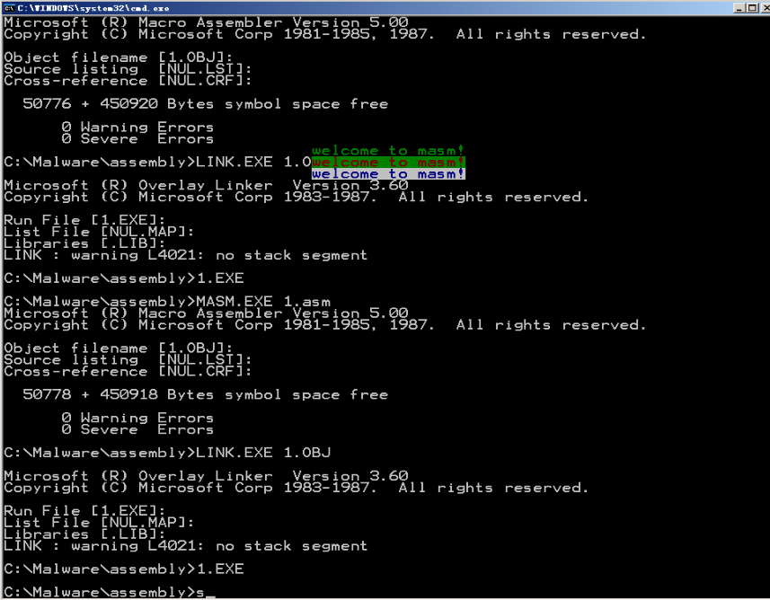

# 编程
## 绿色
```
assume cs:codesg
data segment
    db 'welcome to masm!'
    db 02h,24h,71h
data ends
codesg segment
start:
        mov ax,data
        mov es,ax
        mov ax,0B878h
        mov ds,ax
        mov bx,0

        mov cx,3
        mov bp,16
    s0: mov dx,cx
        mov cx,16
        mov si,0
        mov di,64

    s:  mov al,es:[si]
        mov [bx+di],al
        mov al,es:[bp]
        mov [bx+di+1],al
        add di,2
        inc si
        loop s

        inc bp
        mov cx,dx
        add bx,00A0h
        loop s0

        mov ax,4c00h
        int 21h
codesg ends
end start
```
结果如下：


不确定有没有简单的方法，我用了太多寄存器了。

**这个没那么难，但是如果想写的简单可能需要一些练习。**