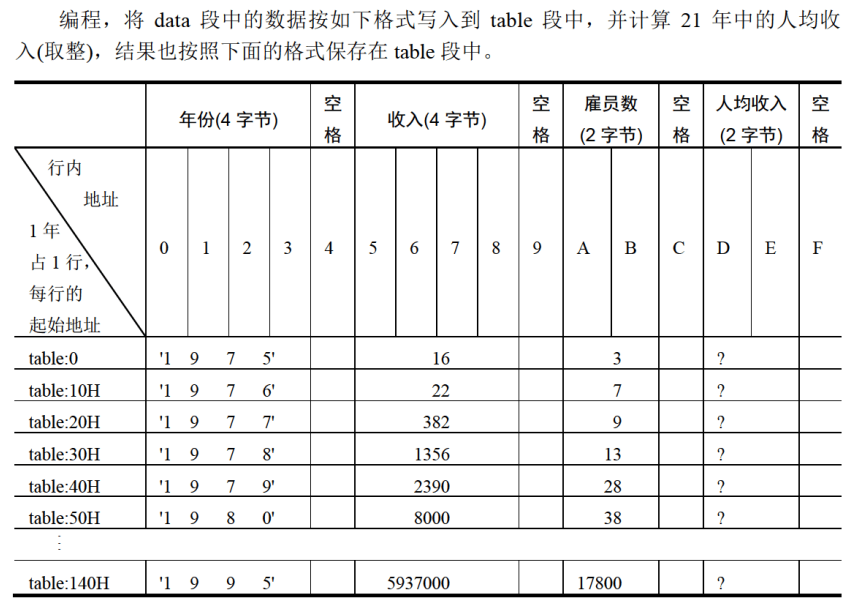
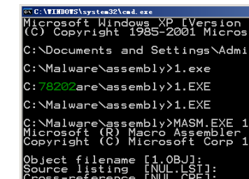
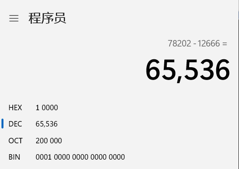
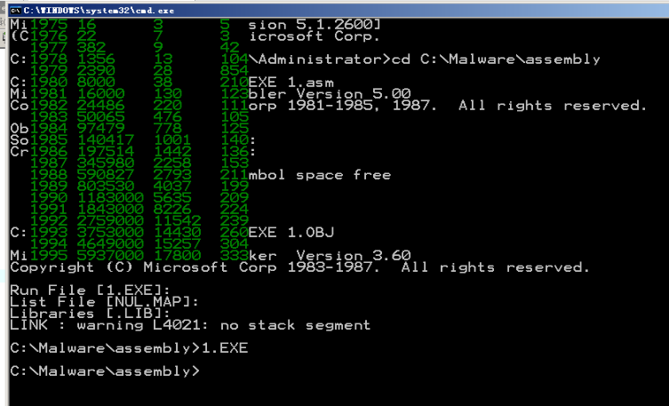

# Project1
首先我们看一下lab7的结果！



其实我们可以看到，lab7的结果已经存在table段之中了。后面要做什么？把收入和雇员还有平均收入，搞成十进制的！然后，这些东西一起展示在屏幕上！

## dtoc
```
assume cs:code,ds:data,ss:stack
data segment
    db 10 dup(0)
data ends

stack segment
    dw 16 dup(0)    ;32字节
stack ends

code segment
start:
    mov dx,1
    mov ax,12666    ;要显示的数据
    MOV BX,DATA
    MOV DS,BX
    mov si,0    ;ds:si指向字符串首地址
    call dtoc    ;将数据转为十进制字符

    mov dh,8    ;在屏幕第几行开始显示
    mov dl,3    ;在屏幕第几列开始显示
    mov cl,2    ;显示的字符的颜色
    call show_str

    mov ax,4c00H    ;程序返回
    int 21H


dtoc:    ;功能：将给定的word型数据转为十进制字符形式，存入data段，首地址ds:si
            ;参数：ax 指定的word数据
            ;返回：ds:si指向data段字符串首地址
        PUSH AX
        PUSH BX
        PUSH CX
        PUSH DX
        PUSH SI
        SUB BX,BX

PUSHREMAINDER:
        MOV CX,0AH
        CALL DIVDW

        PUSH CX
        MOV CX,DX
        ADD CX,AX
        INC BL
        JCXZ POPREMAINDER
        JMP SHORT PUSHREMAINDER

POPREMAINDER:
        MOV CX,BX

    S1: POP AX
        ADD AL,30H
        MOV DS:[SI],AL
        INC SI
        LOOP S1
	POP SI
        POP DX
        POP CX
        POP BX
        POP AX
        RET
divdw:
	PUSH bx
        push ax             ;将被除数低16位先压栈保存。
        mov ax, dx          ;（ax）=（dx）
        mov dx, 0000H       ;
        div cx              ;被除数dx+ax（组合），除数cx。
        mov bx, ax          ;将H/N结果的商先保存在bx中，（bx）=0001H
        pop ax              ;将L值弹栈到ax
        div cx
        mov cx, dx          ;返回值（cx）等于最终结果的余数
        mov dx, bx          ;最终结果高16位值=（bx）
        POP bx
        ret

show_str:
        push cx
        push bx
        push ax
        push bp
        push di
        mov ch,0
        mov bp,cx         ;保护cl

        mov ax,0b800h   ;显存空间首地址
        mov es,ax
        mov cl,dh
        mov ch,0
        dec cx
        sub bx,bx       ;先算行

    s:  add bx,00a0h
        loop s

        mov al,DL
        MOV AH,0
        ADD AX,ax
        SUB AX,2          ;再算列
	MOV DI,ax

change: mov cl,DS:[si]
        mov ch,0
        jcxz ok

        mov al,ds:[si]
        mov es:[bx+di],al
        mov ax,bp
        mov byte ptr es:[bx+di+1],al

        inc SI
        ADD DI,2
        jmp short change

    ok: pop di
        pop bp
        pop ax
        pop bx
        pop cx
        ret
code ends
end start
```


是这么个结果



可见改的没毛病。
## 答案
```
assume cs:code,ss:stack
data segment
    db '                       ',0
data ends

stack segment
    dw 16 dup(0)    ;32字节
stack ends

datasg segment
    db '1975', '1976', '1977', '1978', '1979', '1980', '1981'
    db '1982', '1983', '1984', '1985', '1986', '1987', '1988'
    db '1989', '1990', '1991', '1992', '1993', '1994', '1995'

    dd 16, 22, 382, 1356, 2390, 8000, 16000, 24486, 50065, 97479
    dd 140417, 197514, 345980, 590827, 803530, 1183000, 1843000
    dd 2759000, 3753000, 4649000, 5937000

    dw 3, 7, 9, 13, 28, 38, 130, 220, 476, 778, 1001, 1442, 2258
    dw 2793, 4037, 5635, 8226, 11542, 14430, 15257, 17800
datasg ends

table segment
    db 21 dup ('year summ ne ?? ')
table ends

code segment

start:
        mov ax,datasg
        mov es,ax               ;data绑es

        mov ax,table
        mov ds,ax               ;table绑ds,这样寻址的时候不用写段地址

        sub bx,bx
        sub si,si
        mov di,168              ;这个必须自己算一下，4*21+4*21
                                ;这里本来想全用si，但是问题在于si加的话，一个收入是DWORD，一个人数是WORD，直接加会导致跳过一个人数，等于你1976对应的人是1977的，1977对应的人是1979的。没办法只能用新的寄存器存了

        mov cx,21
    s:  mov ax,es:[si]
        mov [bx].0h[0],ax
        mov ax,es:[si+2]
        mov [bx].0h[2],ax       ;存年份，四个byte，存两次即可

        mov ax,es:[di]
        mov [bx].10[0],ax       ;人数是字，直接存

        mov ax,es:[si+84]
        mov [bx].5[0],ax
        mov dx,es:[si+86]
        mov [bx].5[2],dx        ;收入是双字，要存两次，然后为了和后面的除法对应上，直接存dx和ax里,这里要注意小端存储
                                ;这里可以看到，一个年份和对应的收入，其实大小都是4字节的。这样si可以一次循环内使用。

        div word ptr es:[di]    ;指明除数的长度
        mov [bx].13[0],ax

        add bx,10h
        add si,4
        add di,2
        loop s

        ;底下就是新的内容了
        mov ax,data
        mov ds,ax
        ;ds绑定data
        mov ax,table
        mov es,ax
        ;es绑table

        mov cx,21
        SUB BX,BX;计数器
        sub si,si
        sub di,di
    convert:
        sub si,si
        push cx

        mov cx,4
    year:
        ;挪年份进去
        mov al,es:[di]
        mov ds:[si],al
        inc si
        inc di
        loop year

        inc di
        inc si

        ;总收入
        mov dx,es:[di+2]
        mov ax,es:[di]
        call dtoc

        add di,5
        add si,8
        mov dx,0
        mov ax,es:[di]
        call dtoc
        ;人

        add di,3
        add si,7
        mov dx,0
        mov ax,es:[di]
        call dtoc
        ;人均

        ；其实上边这几个部分，精心设计一下能写成循环，代码能好看一点点，但是太麻烦了，不写了。


        mov si,0    ;ds:si指向字符串首地址

        mov dh,BL    ;在屏幕第几行开始显示
        mov dl,3    ;在屏幕第几列开始显示
        mov cl,2    ;显示的字符的颜色
        call show_str

        sub di,13
        add di,10H
        inc bl
        pop cx
        loop convert


    mov ax,4c00H    ;程序返回
    int 21H


dtoc:    ;功能：将给定的word型数据转为十进制字符形式，存入data段，首地址ds:si
            ;参数：ax 指定的word数据
            ;返回：ds:si指向data段字符串首地址
        PUSH AX
        PUSH BX
        PUSH CX
        PUSH DX
        PUSH SI
        SUB BX,BX

PUSHREMAINDER:
        MOV CX,0AH
        CALL DIVDW

        PUSH CX
        MOV CX,DX
        ADD CX,AX
        INC BL
        JCXZ POPREMAINDER
        JMP SHORT PUSHREMAINDER

POPREMAINDER:
        MOV CX,BX

    S1: POP AX
        ADD AL,30H
        MOV DS:[SI],AL
        INC SI
        LOOP S1
	POP SI
        POP DX
        POP CX
        POP BX
        POP AX
        RET
divdw:
	PUSH bx
        push ax             ;将被除数低16位先压栈保存。
        mov ax, dx          ;（ax）=（dx）
        mov dx, 0000H       ;
        div cx              ;被除数dx+ax（组合），除数cx。
        mov bx, ax          ;将H/N结果的商先保存在bx中，（bx）=0001H
        pop ax              ;将L值弹栈到ax
        div cx
        mov cx, dx          ;返回值（cx）等于最终结果的余数
        mov dx, bx          ;最终结果高16位值=（bx）
        POP bx
        ret

show_str:
        push cx
        push bx
        push ax
        push bp
        push di
        push es
        mov ch,0
        mov bp,cx         ;保护cl

        mov ax,0b800h   ;显存空间首地址
        mov es,ax
        mov cl,dh
        mov ch,0
        sub bx,bx       ;先算行

    s2:  add bx,00a0h
        loop s2

        mov al,DL
        MOV AH,0
        ADD AX,ax
        SUB AX,2          ;再算列
	MOV DI,ax

change: mov cl,DS:[si]
        mov ch,0
        jcxz ok

        mov al,ds:[si]
        mov es:[bx+di],al
        mov ax,bp
        mov byte ptr es:[bx+di+1],al

        inc SI
        ADD DI,2
        jmp short change

    ok: pop es
        pop di
        pop bp
        pop ax
        pop bx
        pop cx
        ret
code ends
end start
```


成功！

有点儿难度，自己在写之前要想清楚，不然调起来很费劲。