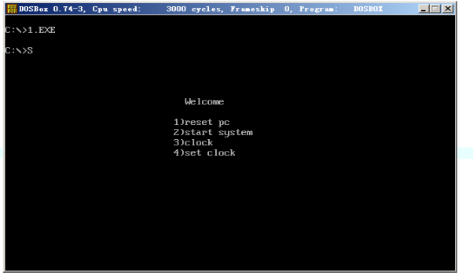

# 程序
需要按步骤来
## dashboard
```
assume cs:code

dashboard segment
    db '  Welcome      '
    db '               '
    db '1)reset pc     '
    db '2)start system '
    db '3)clock        '
    db '4)set clock    '
    db '               '
    db 'TephrocactusMYC'
dashboard ends

code segment

start:
    call showdashboard

    mov ax,4c00h
    int 21h


;这里是展示界面
showdashboard:
    push cx
    push ax
    push si
    push di
    mov ax,0b800h
    mov es,ax
    sub si,si
    mov di,8*160+30*2

    mov ax,dashboard
    mov ds,ax

    mov cx,8
loopdash:
    push cx

    mov cx,15
loopdash1:
    mov al,ds:[si]
    mov es:[di],al
    inc si
    add di,2
    loop loopdash1
    add di,130
    pop cx
    loop loopdash

    pop di
    pop si
    pop ax
    pop cx
    ret

code ends
end start
```


可见dashboard展示成功！

这里我自己做了美化.

然后也改为int 16h中断调用
```
assume cs:code

dashboard segment
    db '  Welcome      '
    db '               '
    db '1)reset pc     '
    db '2)start system '
    db '3)clock        '
    db '4)set clock    '
    db '               '
    db 'TephrocactusMYC'
dashboard ends

code segment

start:
    MOV AH,0
    INT 16H
    CMP AH,1
    JE showdashboard


    mov ax,4c00h
    int 21h

;这里是展示界面
showdashboard:
    push cx
    push ax
    push si
    push di
    mov ax,0b800h
    mov es,ax
    sub si,si
    mov di,8*160+30*2

    mov ax,dashboard
    mov ds,ax

    mov cx,8
loopdash:
    push cx

    mov cx,15
loopdash1:
    mov al,ds:[si]
    mov es:[di],al
    inc si
    add di,2
    loop loopdash1
    add di,130
    pop cx
    loop loopdash

    pop di
    pop si
    pop ax
    pop cx
    ret

code ends
end start
```
## 按FI改变颜色
这个书里给了
```
assume cs:code
stack segment
    db 128 dup(0)
stack ends
code segment
start:
    mov ax,stack
    mov ss,ax
    mov sp,128

    push cs
    pop ds

    mov ax,0
    mov es,ax

    mov si,offset int9
    mov di,204h
    mov cx,offset int9end-offset int9
    cld
    rep movsb

    push es:[9*4]
    pop es:[200h]
    push es:[9*4+2]
    pop es:[202h]

    cli
    mov word ptr es:[9*4],204h
    mov word ptr es:[9*4+2],0
    sti

    mov ax,4c00h
    int 21h

int9:
    push ax
    push bx
    push cx
    push es

    in al,60h
    pushf
    call dword ptr cs:[200h]

    cmp al,3bh
    je changecolor
    jne int9ret

changecolor:
    mov ax,0b800h
    mov es,ax
    mov bx,1
    mov cx,2000
loopint9:
    inc byte ptr es:[bx]
    add bx,2
    loop loopint9

int9ret:
    pop es
    pop cx
    pop bx
    pop ax
    iret

int9end:nop
code ends
end start
```
改写一下变成安装的程序。
```
assume cs:code
stack segment
    db 128 dup(0)
stack ends
code segment
start:
    mov ax,stack
    mov ss,ax
    mov sp,128

    push cs
    pop ds

    mov ax,0
    mov es,ax

    call install_int9

    mov ax,4c00h
    int 21h


install_int9:
    mov si,offset int9_start
    mov di,204h
    mov cx,offset int9_end-offset int9_start
    cld
    rep movsb

    push es:[9*4]
    pop es:[200h]
    push es:[9*4+2]
    pop es:[202h]

    cli
    mov word ptr es:[9*4],204h
    mov word ptr es:[9*4+2],0
    sti
    ret


int9_start:
    push ax
    push bx
    push cx
    push es

    in al,60h
    pushf
    call dword ptr cs:[200h]

    cmp al,3bh
    je changecolor
    jne int9ret

changecolor:
    mov ax,0b800h
    mov es,ax
    mov bx,1
    mov cx,2000
loopint9:
    inc byte ptr es:[bx]
    add bx,2
    loop loopint9

int9ret:
    pop es
    pop cx
    pop bx
    pop ax
    iret

int9_end:nop
code ends
end start
```
可以实现功能
## 展示时间
前面写(抄+改)过一个，那个看起来不太星，自己写了。。。

改两件事：
- 一是正常的输出，之前写的还有颜色啥的，这里都不需要了。
- 二是重头戏，循环，也就是说每秒展示的都是当前的状态，这个怎么办呢，弄个循环，每次循环结束之前inc cx即可

*ps:这个设计感觉有些问题，因为CPU执行的速度太快了，每秒可能执行了上万次，这样虽然是每秒展示实时时间，但其实每一秒展示了上万次了*
```
assume cs:code

timeshow segment
    db 'yy/mm/ss hh:mm:ss',0   ;输出模板
timeshow ends

code segment
    cmos db 9,8,7,4,2,0
 start:
        call showtime
        mov cx,4c00h
        int 21h

showtime:
        mov ax,timeshow
        mov ds,AX
        mov ax,0b800h   ;显存空间首地址
        mov es,ax
        call print_time

readtime:
        mov cx,6
        sub si,si
        mov di,12*160+26*2
SIXTIME:
        mov al,cmos[si]
        out 70h,al
        in al,71h

        mov ah,al
        shr ah,1
        shr ah,1
        shr ah,1
        shr ah,1
        and al,00001111b
        add ah,30h
        add al,30h

        mov es:[di],ah
        mov es:[DI+2],al

        inc si
        add di,6
        loop SIXTIME
        JMP readtime

        ret

print_time:
        push ax
        push ES
        push bx
        push cx
        push si
        push DI
	SUB DI,DI
        sub si,si
        mov ax,0b800h   ;显存空间首地址
        mov es,ax
        mov bx,12*160+26*2

change: mov cl,ds:[si]
        mov ch,0
        jcxz ok

        mov al,ds:[si]
        mov es:[bx+di],al
        inc SI
        ADD DI,2
        jmp short change

    ok: pop di
        pop si
        pop cx
        pop bx
        pop es
        pop ax
        RET

code ends
end start
```
## 组合
接下来把显示时钟和展示封面，还有互相之间的切换，组合起来。

这里要做的不少，一是处理按`ESC`之后切换，而是按`3`之后切换到时钟这里，这里需要注意清屏。
### 清屏
首先我们来看一下这个清屏的子过程
```
;清屏的
;================================================
clearscreen:
    push bx
    push cx
    push es
    mov bx,0b800h
    mov es,bx
    mov bx,0
    mov cx,2000
subclear:
    mov byte ptr es:[bx],' '
    add bx,2
    loop subclear

    pop es
    pop cx
    pop bx
    ret
;================================================
```
### 组合
然后组合
```
assume cs:code,ss:stack
timeshow segment
    db 'yy/mm/ss hh:mm:ss',0   ;输出模板
timeshow ends

data segment
	db	128 dup (0)
data ends

stack segment stack
	db	128 dup (0)
stack ends

dashboard segment
    db '  Welcome      '
    db '               '
    db '1)reset pc     '
    db '2)start system '
    db '3)clock        '
    db '4)set clock    '
    db '               '
    db 'TephrocactusMYC'
dashboard ends

code segment

	start:	mov ax,stack
		mov ss,ax
		mov sp,128
		call cpy_boot
		call sav_old_int9

		mov bx,0
		push bx
		mov bx,7E00H
		push bx
		retf

		mov ax,4C00H
		int 21H


;========================================================
Boot:		jmp BOOT_START
cmos db 9,8,7,4,2,0
BOOT_START:	call init_reg
		call clearscreen
		call showdashboard
		jmp choose_option

		mov ax,4C00H
		int 21H

;=======================================================
choose_option:	call clear_buff

		mov ah,0
		int 16H
		cmp al,'1'
		je isChooseOne
		cmp al,'2'
		je isChooseTwo
		cmp al,'3'
		je isChooseThree
		cmp al,'4'
		je isChooseFour

		jmp showdashboard

isChooseOne:	mov di,160*4
		mov byte ptr es:[di],'1'
		jmp choose_option

isChooseTwo:	mov di,160*4
		mov byte ptr es:[di],'2'
		jmp choose_option

isChooseThree:	mov di,160*4
		mov byte ptr es:[di],'3'
		call showtime
		jmp BOOT_START

isChooseFour:	mov di,160*4
		mov byte ptr es:[di],'4'
		jmp choose_option

;这里是展示界面
;=======================================================
showdashboard:
    push cx
    push ax
    push si
    push di
    mov ax,0b800h
    mov es,ax
    sub si,si
    mov di,8*160+30*2

    mov ax,dashboard
    mov ds,ax

    mov cx,8
loopdash:
    push cx

    mov cx,15
loopdash1:
    mov al,ds:[si]
    mov es:[di],al
    inc si
    add di,2
    loop loopdash1
    add di,130
    pop cx
    loop loopdash

    pop di
    pop si
    pop ax
    pop cx
    ret
;=======================================================
showtime:
	call clearscreen
        mov ax,0b800h   ;显存空间首地址
        mov es,ax
        call print_time
        call set_new_int9
        MOV AX,0
        MOV DS,ax

readtime:
        mov cx,6
        mov si,OFFSET CMOS - OFFSET Boot + 7E00H
        mov di,12*160+26*2
SIXTIME:
        mov al,DS:[si]
        out 70h,al
        in al,71h

        mov ah,al
        shr ah,1
        shr ah,1
        shr ah,1
        shr ah,1
        and al,00001111b
        add ah,30h
        add al,30h

        mov es:[di],ah
        mov es:[DI+2],al

        inc si
        add di,6
        loop SIXTIME
        JMP readtime

        ret

print_time:
        push ax
        push bx
        push cx
        push si
        push DI
        PUSH ds
	    SUB DI,DI
        sub si,SI
        mov ax,timeshow
        mov ds,AX
        mov bx,12*160+26*2

change: mov cl,ds:[si]
        mov ch,0
        jcxz ok

        mov al,ds:[si]
        mov es:[bx+di],al
        inc SI
        ADD DI,2
        jmp short change

    ok: POP ds
    	pop di
        pop si
        pop cx
        pop bx
        pop ax
        RET

showDateOver:	call set_old_int9

		ret

;=======================================================
set_old_int9:
		push bx
		push es

		mov bx,0
		mov es,bx

		cli
		push es:[200H]
		pop es:[9*4]
		push es:[202H]
		pop es:[9*4+2]
		sti

		pop es
		pop bx
		ret
;=======================================================
set_new_int9:	push bx
		push es

		mov bx,0
		mov es,bx

		mov word ptr es:[9*4],OFFSET new_int9 - OFFSET Boot + 7E00H
		mov word ptr es:[9*4+2],0

		pop es
		pop bx
		ret
;=======================================================
new_int9:	push ax

		call clear_buff

		in al,60H
		pushf
		call dword ptr cs:[200H]

		cmp al,01H
		je isEsc
		cmp al,3BH
		jne int9Ret
		call changecolor


int9Ret:	pop ax
		iret


isEsc:		pop ax
		add sp,4
		popf
		jmp showDateOver

;=======================================================
changecolor:
    push ax
    push bx
    push cx
    push es
    mov ax,0b800h
    mov es,ax
    mov bx,1
    mov cx,2000
loopint9:
    inc byte ptr es:[bx]
    add bx,2
    loop loopint9

    pop es
    pop cx
    pop bx
    pop ax
    ret
;=======================================================
clear_buff:	mov ah,1
		int 16H
		jz clearBuffRet
		mov ah,0
		int 16H
		jmp clear_buff

clearBuffRet:	ret

;清屏，这里做了修改，为了不让F1的效果一直保留。
;=======================================================
clearscreen:
    push bx
    push cx
    push es
    mov bx,0b800h
    mov es,bx
    mov bx,0
    mov cx,2000
subclear:
    mov byte ptr es:[bx],' '
    add bx,2
    loop subclear

    pop es
    pop cx
    pop bx
    ret
;=======================================================
init_reg:
		mov bx,0B800H
		mov es,bx

		mov bx,0
		mov ds,bx
		ret

Boot_end:	nop

;========================================================
sav_old_int9:	mov bx,0
		mov es,bx

		push es:[9*4]
		pop es:[200H]
		push es:[9*4+2]
		pop es:[202H]

		ret
;========================================================
cpy_boot:
		mov bx,cs
		mov ds,bx
		mov si,OFFSET Boot

		mov bx,0
		mov es,bx
		mov di,7E00H

		mov cx,OFFSET Boot_end - OFFSET Boot
		cld
		rep movsb

		ret

code ends

end start
```

### 加入修改时间
```
assume cs:code,ss:stack
timeshow segment
    db 'yy/mm/ss hh:mm:ss',0   ;输出模板
timeshow ends

data segment
	db	128 dup (0)
data ends

stack segment stack
	db	512 dup (0)
stack ends

dashboard segment
    db '  Welcome      '
    db '               '
    db '1)reset pc     '
    db '2)start system '
    db '3)clock        '
    db '4)set clock    '
    db '               '
    db 'TephrocactusMYC'
dashboard ends

code segment

	start:	mov ax,stack
		mov ss,ax
		mov sp,128
		call cpy_boot
		call sav_old_int9

		mov bx,0
		push bx
		mov bx,7E00H
		push bx
		retf

		mov ax,4C00H
		int 21H


;========================================================
Boot:		jmp BOOT_START
cmos db 9,8,7,4,2,0
STRING_STACK db 'YYMMDDhhmmss',0
BOOT_START:	call init_reg
		call clearscreen
		call showdashboard
		jmp choose_option

		mov ax,4C00H
		int 21H

;=======================================================
choose_option:	call clear_buff

		mov ah,0
		int 16H
		cmp al,'1'
		je isChooseOne
		cmp al,'2'
		je isChooseTwo
		cmp al,'3'
		je isChooseThree
		cmp al,'4'
		je isChooseFour

		jmp showdashboard

isChooseOne:	mov di,160*4
		mov byte ptr es:[di],'1'
		jmp choose_option

isChooseTwo:	mov di,160*4
		mov byte ptr es:[di],'2'
		jmp choose_option

isChooseThree:	mov di,160*4
		mov byte ptr es:[di],'3'
		call showtime
		jmp BOOT_START

isChooseFour:	mov di,160*4
		mov byte ptr es:[di],'4'
        call changetime
		jmp BOOT_START

;这里是展示界面
;=======================================================
showdashboard:
    push cx
    push ax
    push si
    push di
    mov ax,0b800h
    mov es,ax
    sub si,si
    mov di,8*160+30*2

    mov ax,dashboard
    mov ds,ax

    mov cx,8
loopdash:
    push cx

    mov cx,15
loopdash1:
    mov al,ds:[si]
    mov es:[di],al
    inc si
    add di,2
    loop loopdash1
    add di,130
    pop cx
    loop loopdash

    pop di
    pop si
    pop ax
    pop cx
    ret
;改变时间
;=======================================================
changetime:
        call clear_string_stack
        call clearscreen
        call show_string_stack
        CALL get_string
	CALL set_cmos_time

ret
;=======================================================
clear_string_stack:
        push bx
        push ds
        push si
        mov bx,0
		mov ds,bx
		mov si,OFFSET STRING_STACK - OFFSET Boot + 7E00H

		mov ds:[si],5959H
        add si,2
        mov ds:[si],4d4dH
        add si,2
        mov ds:[si],4444H
        add si,2
        mov ds:[si],6868H
        add si,2
        mov ds:[si],6d6dH
        add si,2
        mov ds:[si],7373H

        pop si
        pop ds
        pop bx
		ret


;=======================================================
show_string_stack:
		push si
		push di
        push bx
        push cx
        push ds
        push es

        mov bx,0
		mov ds,bx
        mov bx,timeshow
        mov es,bx
		mov si,OFFSET STRING_STACK - OFFSET Boot + 7E00H
		sub di,di

        mov cx,6
loopstack:
        mov bl,ds:[si]
        mov es:[di],bl
        mov bl,ds:[si+1]
        mov es:[di+1],bl
        add si,2
        add di,3
        loop loopstack
        MOV bx,0b800h
	    MOV ES,bx
		call print_time

        pop es
        pop ds
        pop cx
        pop bx
		pop di
		pop si
		ret

;=======================================================
set_cmos_time:
        push dx
        push DS
        PUSH SI
        PUSH bx
        PUSH CX
        PUSH ax
        mov bx,0
        mov ds,bx

        mov si,OFFSET STRING_STACK - OFFSET Boot + 7E00H		;STRING

		mov bx,OFFSET CMOS - OFFSET Boot + 7E00H		;CMOS

		mov cx,6


setCmosTime:	mov dx,ds:[si]							;'12' DX = '21'
		sub dh,30H							;dh = '2'	dl = '1'
		sub dl,30H
		shl dl,1
		shl dl,1
		shl dl,1
		shl dl,1
		and dh,00001111B

		or dl,dh

		mov al,ds:[bx]
		out 70H,al
		mov al,dl
		out 71H,al

		add si,2
		inc bx
		loop setCmosTime
	POP ax
	POP cx
	POP bx
	POP si
        pop ds
        pop dx
		ret
;=======================================================
get_string:
        push si
        push bx
        PUSH DS
        PUSH ax
        mov si,OFFSET STRING_STACK - OFFSET Boot + 7E00H
		mov bx,0
		MOV DS,bx
		call clear_buff

getString:	mov ah,0
		int 16H
		cmp al,'0'
		jb notNumber
		cmp al,'9'
		ja notNumber
		call char_push
		call show_string_stack
		jmp getString

isEnter:
	POP ax
	POP ds
        pop bx
        pop si
        ret

notNumber:	cmp ah,1CH
		je isEnter
		cmp ah,0EH
		je isBackSpace
		jmp getString

;=======================================================
isBackSpace:	call char_pop
		call show_string_stack
		jmp getString

;=======================================================
char_pop:
        cmp bx,0
		je charPopRet
		dec bx
		mov byte ptr ds:[si+bx],'?'

charPopRet:
            ret
;=======================================================
char_push:
        cmp bx,11
		ja charPushRet
		mov ds:[si+bx],al
		inc bx
charPushRet:
        ret

;=======================================================
showtime:
	call clearscreen
        mov ax,0b800h   ;显存空间首地址
        mov es,ax
        call print_time
        call set_new_int9
        MOV AX,0
        MOV DS,ax

readtime:
        mov cx,6
        mov si,OFFSET CMOS - OFFSET Boot + 7E00H
        mov di,12*160+26*2
SIXTIME:
        mov al,DS:[si]
        out 70h,al
        in al,71h

        mov ah,al
        shr ah,1
        shr ah,1
        shr ah,1
        shr ah,1
        and al,00001111b
        add ah,30h
        add al,30h

        mov es:[di],ah
        mov es:[DI+2],al

        inc si
        add di,6
        loop SIXTIME
        JMP readtime

        ret

print_time:
        push ax
        push bx
        push cx
        push si
        push DI
        PUSH ds
	    SUB DI,DI
        sub si,SI
        mov ax,timeshow
        mov ds,AX

        mov bx,12*160+26*2

change: mov cl,ds:[si]
        mov ch,0
        jcxz ok

        mov al,ds:[si]
        mov es:[bx+di],al
        inc SI
        ADD DI,2
        jmp short change

    ok: POP ds
    	pop di
        pop si
        pop cx
        pop bx
        pop ax
        RET

showDateOver:	call set_old_int9

		ret

;=======================================================
set_old_int9:
		push bx
		push es

		mov bx,0
		mov es,bx

		cli
		push es:[200H]
		pop es:[9*4]
		push es:[202H]
		pop es:[9*4+2]
		sti

		pop es
		pop bx
		ret
;=======================================================
set_new_int9:	push bx
		push es

		mov bx,0
		mov es,bx

		mov word ptr es:[9*4],OFFSET new_int9 - OFFSET Boot + 7E00H
		mov word ptr es:[9*4+2],0

		pop es
		pop bx
		ret
;=======================================================
new_int9:	push ax

		call clear_buff

		in al,60H
		pushf
		call dword ptr cs:[200H]

		cmp al,01H
		je isEsc
		cmp al,3BH
		jne int9Ret
		call changecolor


int9Ret:	pop ax
		iret


isEsc:		pop ax
		add sp,4
		popf
		jmp showDateOver

;=======================================================
changecolor:
    push ax
    push bx
    push cx
    push es
    mov ax,0b800h
    mov es,ax
    mov bx,1
    mov cx,2000
loopint9:
    inc byte ptr es:[bx]
    add bx,2
    loop loopint9

    pop es
    pop cx
    pop bx
    pop ax
    ret
;=======================================================
clear_buff:	mov ah,1
		int 16H
		jz clearBuffRet
		mov ah,0
		int 16H
		jmp clear_buff

clearBuffRet:	ret

;清屏，这里做了修改，为了不让F1的效果一直保留。
;=======================================================
clearscreen:
    push bx
    push cx
    push es
    mov bx,0b800h
    mov es,bx
    mov bx,0
    mov cx,2000
subclear:
    mov byte ptr es:[bx],' '
    add bx,2
    loop subclear

    pop es
    pop cx
    pop bx
    ret
;=======================================================
init_reg:
		mov bx,0B800H
		mov es,bx

		mov bx,0
		mov ds,bx
		ret

Boot_end:	nop

;========================================================
sav_old_int9:	mov bx,0
		mov es,bx

		push es:[9*4]
		pop es:[200H]
		push es:[9*4+2]
		pop es:[202H]

		ret
;========================================================
cpy_boot:
		mov bx,cs
		mov ds,bx
		mov si,OFFSET Boot

		mov bx,0
		mov es,bx
		mov di,7E00H

		mov cx,OFFSET Boot_end - OFFSET Boot
		cld
		rep movsb

		ret

code ends

end start
```
其实到这里也就可以停止了，磁盘读写有些无聊。
### 效果
<video src="./tmp-result.mp4" width="800px" height="600px" controls="controls"></video>

### 告一段落
磁盘读写没有搞，虚拟机做磁盘再那样调试我觉得很浪费时间。我上面的写法还有个问题就是dashboard没复制过去，因此如果真是复制到软盘大概率什么都没有。(但是会有功能，只是没显示)
## 其他
一开始写了很久也无法解决问题功能切换和回到dashboard的问题，后来才发现需要用到16号中断的1号功能，这个王爽书里没讲，有些奇怪，基本上搜了搜都是用到了这个书里没有的东西。这是唯一的难点，磁盘读写什么的其实不值一提。

在写好了dashboard和展示时间之后，基本上本次实验的目的也就达到了，最终也没什么兴趣再写磁盘读写相关的东西了，参考了很多网上的答案 ~~最后攒了一个~~ ，网上看到的答案也都列举在后面了。别的就没什么了。
# 总结
到了这里，基本上王爽这本书的使命也就到头了。可以说是一个很好的入门书，但是不足也有很多，涉及的内容有些少了，应该与其他讲汇编语言的书配套使用。

# 一些参考
看见一个老哥做的不错，他的[链接](https://blog.csdn.net/qq_66550041/article/details/122606740)。

一个使用[其他环境实现的老哥](https://blog.csdn.net/goodcrony/article/details/92153256)

一个[参考](https://blog.csdn.net/chengshawen7815/article/details/100991195)

不错的[讲解](https://blog.csdn.net/hne71/article/details/104050556)

一个[实现](https://blog.csdn.net/cccp15/article/details/117454392)

[B站的一个课，讲了这个作业](https://www.bilibili.com/video/BV1At411m753?p=184&vd_source=77d47fcb2bac41ab4ad02f265b3273cf)

[好像有很多都出自上面的B站课程，这里这个也是](https://blog.csdn.net/weixin_41944412/article/details/80836632)

[也是个搭环境的](https://blog.csdn.net/apollon_krj/article/details/72026944)

[参考](https://blog.csdn.net/m0_48836226/article/details/120718381)